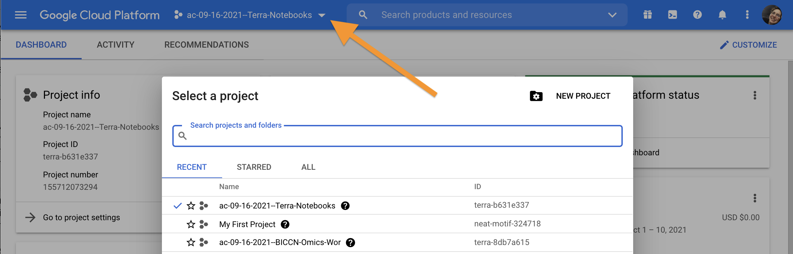
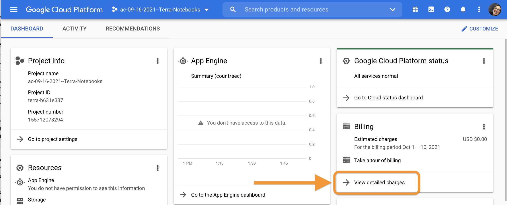
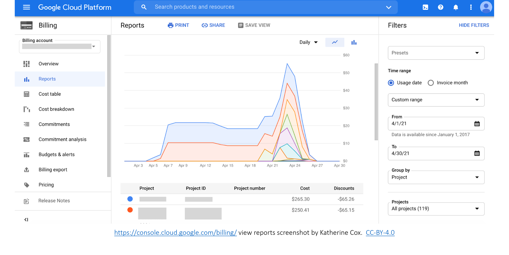

# (PART\*) Billing {-}

```{r, include = FALSE}
ottrpal::set_knitr_image_path()
```

# Set Up Billing for Your Class

The following will help you set up billing for your class. You will:  
* Set up a billing project for tracking costs
* Add yourself and students to the billing project to grant permission to AnVIL resources
* Learn about different sources of costs in AnVIL
* Estimate costs for your class
* Learn about how to track costs during your class

## Creating a Billing Project {#billing-project}

First, create the Billing Project. Billing Project names must be globally unique and cannot exceed 30 characters. We suggest the name of the Billing Project should be a combination of institution-class- (e.g., "jhu-bmr2021-bill-1"). To create a Billing Project:

1. Go to https://anvil.terra.bio/#billing

1. Click “+CREATE”

    ```{r, echo=FALSE, fig.alt='Screenshot of the Terra Billing page. The "+CREATE" button is highlighted.'}
ottrpal::include_slide("https://docs.google.com/presentation/d/1HHWg47Tg6miv_K7GNB6ZDTx-4Jc5IMl7APfFtD1Rqag/edit#slide=id.gdb96a00840_0_88")
    ```

1. Type in your Billing Project name

    ```{r, echo=FALSE, fig.alt='Screenshot of the Terra Billing page with Create Billing Project pop out box. The new billing project name, jhu-bmr2021-instructors-bill-1, is highlighted.'}
ottrpal::include_slide("https://docs.google.com/presentation/d/1HHWg47Tg6miv_K7GNB6ZDTx-4Jc5IMl7APfFtD1Rqag/edit#slide=id.gdb96a00840_0_98")
    ```
    
1. Select the appropriate Billing Account

    ```{r, echo=FALSE, fig.alt='Screenshot of the Terra Billing page with Create Billing Project pop out box. The appropriate billing account name, My Billing Account, is highlighted.'}
ottrpal::include_slide("https://docs.google.com/presentation/d/1HHWg47Tg6miv_K7GNB6ZDTx-4Jc5IMl7APfFtD1Rqag/edit#slide=id.g100474897dd_0_2")
    ```
    
1. Click “CREATE BILLING PROJECT”

    ```{r, echo=FALSE, fig.alt='Screenshot of the Terra Billing page with Create Billing Project pop out box. The "CREATE BILLING PROJECT" button is highlighted.'}
ottrpal::include_slide("https://docs.google.com/presentation/d/1HHWg47Tg6miv_K7GNB6ZDTx-4Jc5IMl7APfFtD1Rqag/edit#slide=id.g100474897dd_0_9")
    ```
    
You now have a unique **Billing Project**.

## Adding Instructors as “Owner”

Next, you want to give instructors permission to use the Billing Project to compute. To set instructor permissions:

1. Go to https://anvil.terra.bio/#billing

1. Select the “Owned by You” Billing Project sub-list

    ```{r, echo=FALSE, fig.alt='Screenshot of the AnVIL Billing page. The "Owned by You" billing list is highlighted.'}
ottrpal::include_slide("https://docs.google.com/presentation/d/1HHWg47Tg6miv_K7GNB6ZDTx-4Jc5IMl7APfFtD1Rqag/edit#slide=id.g1007b9b3ffb_0_0")
    ```

1. Select the Billing Project you made in [Instructor Billing Project](#billing-project)

    ```{r, echo=FALSE, fig.alt='Screenshot of the AnVIL Billing page. The "Owned by You" billing list has been expanded. The instructor Billing project, in this case jhu-bmr2021-instructors, is highlighted.'}
ottrpal::include_slide("https://docs.google.com/presentation/d/1HHWg47Tg6miv_K7GNB6ZDTx-4Jc5IMl7APfFtD1Rqag/edit#slide=id.g1007b9b3ffb_0_10")
    ```

1. Select the “Users” tab

    ```{r, echo=FALSE, fig.alt='Screenshot of the AnVIL Billing page. The instructor Billing project, in this case jhu-bmr2021-instructors, has been selected and the Users Tab is highlighted.'}
ottrpal::include_slide("https://docs.google.com/presentation/d/1HHWg47Tg6miv_K7GNB6ZDTx-4Jc5IMl7APfFtD1Rqag/edit#slide=id.g1007b9b3ffb_0_24")
    ```

1. Click “+ Add User”. You will be prompted to add a “User email *”.

    ```{r, echo=FALSE, fig.alt='Screenshot of the AnVIL Billing page. The instructor Billing project, in this case jhu-bmr2021-instructors, has been selected and the "+Add User" button is highlighted.'}
ottrpal::include_slide("https://docs.google.com/presentation/d/1HHWg47Tg6miv_K7GNB6ZDTx-4Jc5IMl7APfFtD1Rqag/edit#slide=id.g1007b9b3ffb_0_39")
    ```

1. Begin typing the instructor Group name set up in [Instructor Group](#instructor-group). You should see an email in the form <group-name>@firecloud.org (e.g., jhu-bmr2021-instructors@firecloud.org).

1. Ensure “Can manage users (Owner)” is **selected**

    ```{r, echo=FALSE, fig.alt='Screenshot of the AnVIL Billing page with the "Add User" pop out box. The instructor Group email, in this case jhu-bmr2021-instructors@firecloud.org, has been filled in and the Owner role checkbox has been ticked.'}
ottrpal::include_slide("https://docs.google.com/presentation/d/1HHWg47Tg6miv_K7GNB6ZDTx-4Jc5IMl7APfFtD1Rqag/edit#slide=id.g1007b9b3ffb_0_54")
    ```

1. Click “ADD USER”

    ```{r, echo=FALSE, fig.alt='Screenshot of the AnVIL Billing page with the "Add User" pop out box. The instructor Group email, in this case jhu-bmr2021-instructors@firecloud.org, has been filled in and the Owner role checkbox has been ticked. The "ADD USER" button is highlighted.'}
ottrpal::include_slide("https://docs.google.com/presentation/d/1HHWg47Tg6miv_K7GNB6ZDTx-4Jc5IMl7APfFtD1Rqag/edit#slide=id.g1007b9b3ffb_0_70")
    ```


::: {.notice}
This step makes it so that co-instructors can edit permissions and administer the Billing Project as needed. While this means you and co-instructors can compute using the student Billing Project, this makes spending difficult to track. Instructors should always use the **instructor Workspace** to compute. This makes it much easier to track costs associated with instructors versus students.
:::

## Adding Students as “User”

Next, you will add your student Group to the Billing Project so that they can compute. To set student permissions:

1. Go to https://anvil.terra.bio/#billing

1. Select the “Owned by You” Billing Project sub-list

    ```{r, echo=FALSE, fig.alt='Screenshot of the AnVIL Billing page. The "Owned by You" billing list is highlighted.'}
ottrpal::include_slide("https://docs.google.com/presentation/d/1HHWg47Tg6miv_K7GNB6ZDTx-4Jc5IMl7APfFtD1Rqag/edit#slide=id.g1007b9b3ffb_0_0")
    ```

1. Select the Billing Project you made in [Billing Project](#billing-project)

    ```{r, echo=FALSE, fig.alt='Screenshot of the AnVIL Billing page. The "Owned by You" billing list has been expanded. The student Billing project, in this case jhu-bmr2021-students, is highlighted.'}
ottrpal::include_slide("https://docs.google.com/presentation/d/1HHWg47Tg6miv_K7GNB6ZDTx-4Jc5IMl7APfFtD1Rqag/edit#slide=id.g1007b9b3ffb_0_90")
    ```

1. Select the “Users” tab

    ```{r, echo=FALSE, fig.alt='Screenshot of the AnVIL Billing page. The student Billing project, in this case jhu-bmr2021-students, has been selected and the Users Tab is highlighted.'}
ottrpal::include_slide("https://docs.google.com/presentation/d/1HHWg47Tg6miv_K7GNB6ZDTx-4Jc5IMl7APfFtD1Rqag/edit#slide=id.g1007b9b3ffb_0_301")
    ```

1. Click “+ Add User”. You will be prompted to add a “User email *”.

    ```{r, echo=FALSE, fig.alt='Screenshot of the AnVIL Billing page. The student Billing project, in this case jhu-bmr2021-students, has been selected and the "+Add User" button is highlighted.'}
ottrpal::include_slide("https://docs.google.com/presentation/d/1HHWg47Tg6miv_K7GNB6ZDTx-4Jc5IMl7APfFtD1Rqag/edit#slide=id.g1007b9b3ffb_0_315")
    ```

1. Begin typing the student Group name set up in [Student Group](#student-group). You should see an email in the form <group-name>@firecloud.org (e.g., jhu-bmr2021-students@firecloud.org). 

1. Keep “Can manage users (Owner)” **deselected**.

    ```{r, echo=FALSE, fig.alt='Screenshot of the AnVIL Billing page with the "Add User" pop out box. The student Group email, in this case jhu-bmr2021-students@firecloud.org, has been filled in and the Owner role checkbox has NOT been ticked.'}
ottrpal::include_slide("https://docs.google.com/presentation/d/1HHWg47Tg6miv_K7GNB6ZDTx-4Jc5IMl7APfFtD1Rqag/edit#slide=id.g1007b9b3ffb_0_132")
    ```

1. Click “ADD USER”

    ```{r, echo=FALSE, fig.alt='Screenshot of the AnVIL Billing page with the "Add User" pop out box. The student Group email, in this case jhu-bmr2021-students@firecloud.org, has been filled in and the Owner role checkbox has NOT been ticked. The "ADD USER" button is highlighted.'}
ottrpal::include_slide("https://docs.google.com/presentation/d/1HHWg47Tg6miv_K7GNB6ZDTx-4Jc5IMl7APfFtD1Rqag/edit#slide=id.g1007b9b3ffb_0_327")
    ```

## Understanding the various billing costs

Costs in AnVIL fall into one of three categories: compute costs, storage costs, and network usage (egress) costs. **Compute costs** are those that students accrue when actively using an AnVIL Workspace. Students can clone a Workspace for no cost, but they will begin to accrue costs as soon as they set up a cloud environment. Compute costs are based on how many CPUs you need, as well as how much memory and storage space you choose. You can also pause the Workspace and pay a lower cost per hour than if you were to keep the Workspace running. Current prices can be found [here](https://cloud.google.com/compute/all-pricing#top_of_page).

**Storage costs** are driven by the persistent disk. The persistent disk allows you to store data and installed programs/libraries for a low cost. Students can delete their Workspaces but maintain their persistent disk so they still have access to previous programs they have installed and previous files they've created. Current prices can be found [here](https://cloud.google.com/storage/pricing#storage-pricing%20and%20https://cloud.google.com/compute/all-pricing#localssdpricing).

Finally, **network usage** costs are those involved with transferring data between networks or downloading data from the cloud to your local computer. Current prices can be found [here](https://cloud.google.com/storage/pricing#network-egress).

## Estimating costs before the class begins

AnVIL has a free [AnVIL_Cost_Estimator](https://docs.google.com/spreadsheets/d/1GUN93HDRqDbZ0uktaZjoP-y8Ril1T_VIJnQrjRD6tV4) that allows you estimate compute, storage, and network usage costs for your class. This is a Google sheet that you can tailor to fit your needs. Before you use it, make sure the prices are up to date by following the links at the bottom of the sheet. 

If you need to create a Budget Justification for your class, you can also use the free [AnVIL_Budget_Justification](https://docs.google.com/document/d/145JFLn2hviLmaYF-mO06gbCkG0i4HRaWvkUBKORo85Y/edit) template. 

# How much does a class cost?

One of the advantages of billing projects in Terra is that you can keep track of the costs during real time. You can see how much each Workspace is costing while your course is happening, so there are no unexpected surprises at the end!

Full details about billing in Terra can be found [here](https://support.terra.bio/hc/en-us/articles/4405325218075). These instructions are adapted from Terra Support.

## Viewing Costs in Google Cloud Console

To view the costs being accrued by each billing project, you can go to [https://console.cloud.google.com/billing](https://console.cloud.google.com/billing). At the top of the page, there is a dropdown menu. Choose the billing project name you'd like to view.





Once you are in proper billing project, you click on "View detailed charges" in the Billing section on the far right.





This takes you to a report of the detailed charges accrued by the billing account. Here, you will be able to see the total cost over a time range, as well as costs broken down by services.




## Funding Sources

### NHGRI STRIDES {#strides-funding}

Through the [STRIDES](https://datascience.nih.gov/strides) program, NHGRI makes funding available to new users of the AnVIL, in collaboration with the [NIH Office of Data Science Strategy](https://datascience.nih.gov/about/odss). NHGRI currently supports the [AnVIL Cloud Credits Program (AC2)](https://anvilproject.org/news/2021/04/12/announcing-anvil-cloud-cost-credits-program) and will have a second round of funding available in fall of 2021.
