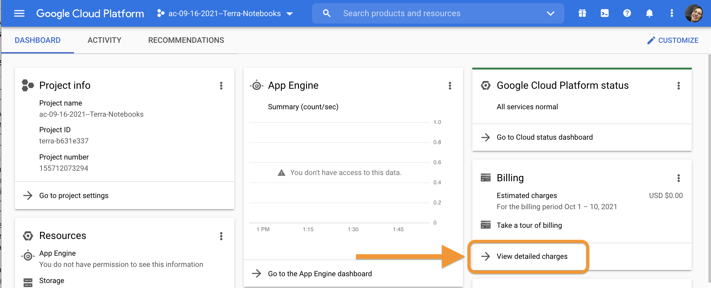
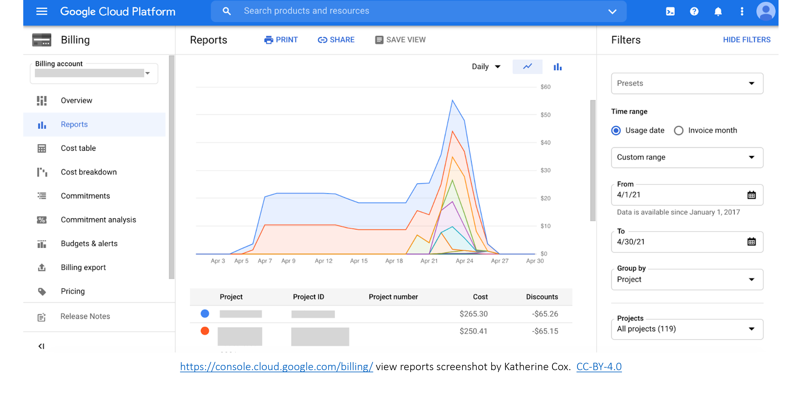

# (PART\*) Cost Management {-}

```{r, include = FALSE}
ottrpal::set_knitr_image_path()
knitr::opts_chunk$set(out.width = "100%")
```

# Understanding AnVIL Billing

The following chapters will help you understand and estimate the cost of running a class on AnVIL.

::: {.notice}
This section is under revision.
:::

## Types of costs

Costs in AnVIL fall into one of three categories: compute costs, storage costs, and network usage (egress) costs. **Compute costs** are those that students accrue when actively using an AnVIL Workspace. Students can clone a Workspace for no cost, but they will begin to accrue costs as soon as they set up a cloud environment. Compute costs are based on how many CPUs you need, as well as how much memory and storage space you choose. You can also pause the Workspace and pay a lower cost per hour than if you were to keep the Workspace running. Current prices can be found [here](https://cloud.google.com/compute/all-pricing#top_of_page).

**Storage costs** are driven by the persistent disk. The persistent disk allows you to store data and installed programs/libraries for a low cost. Students can delete their Workspaces but maintain their persistent disk so they still have access to previous programs they have installed and previous files they've created. Current prices can be found [here](https://cloud.google.com/storage/pricing#storage-pricing%20and%20https://cloud.google.com/compute/all-pricing#localssdpricing).

Finally, **network usage** costs are those involved with transferring data between networks or downloading data from the cloud to your local computer. Current prices can be found [here](https://cloud.google.com/storage/pricing#network-egress).

## Estimating costs before the class begins

AnVIL has a free [AnVIL_Cost_Estimator](https://docs.google.com/spreadsheets/d/1GUN93HDRqDbZ0uktaZjoP-y8Ril1T_VIJnQrjRD6tV4) that allows you estimate compute, storage, and network usage costs for your class. This is a Google sheet that you can tailor to fit your needs. Before you use it, make sure the prices are up to date by following the links at the bottom of the sheet. 

If you need to create a Budget Justification for your class, you can also use the free [AnVIL_Budget_Justification](https://docs.google.com/document/d/145JFLn2hviLmaYF-mO06gbCkG0i4HRaWvkUBKORo85Y/edit) template. 

# How much does a class cost?

One of the advantages of billing projects in Terra is that you can keep track of the costs during real time. You can see how much each Workspace is costing while your course is happening, so there are no unexpected surprises at the end!

Full details about billing in Terra can be found [here](https://support.terra.bio/hc/en-us/articles/4405325218075). These instructions are adapted from Terra Support.

To view the costs being accrued by each billing project, you can go to [https://console.cloud.google.com/billing](https://console.cloud.google.com/billing). At the top of the page, there is a dropdown menu. Choose the billing project name you'd like to view.


Once you are in proper billing project, you click on "View detailed charges" in the Billing section on the far right.





This takes you to a report of the detailed charges accrued by the billing account. Here, you will be able to see the total cost over a time range, as well as costs broken down by services.




## Funding sources

NHGRI STRIDES {#strides-funding}

Through the [STRIDES](https://datascience.nih.gov/strides) program, NHGRI makes funding available to new users of the AnVIL, in collaboration with the [NIH Office of Data Science Strategy](https://datascience.nih.gov/about/odss). NHGRI currently supports the [AnVIL Cloud Credits Program (AC2)](https://anvilproject.org/news/2021/04/12/announcing-anvil-cloud-cost-credits-program) and will have a second round of funding available in fall of 2021.
