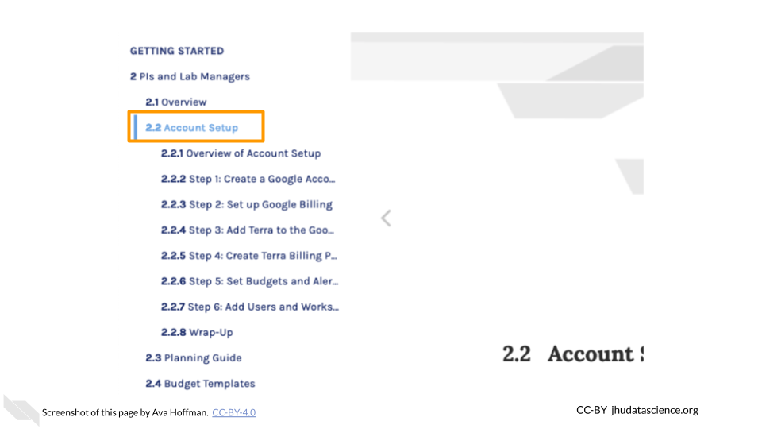
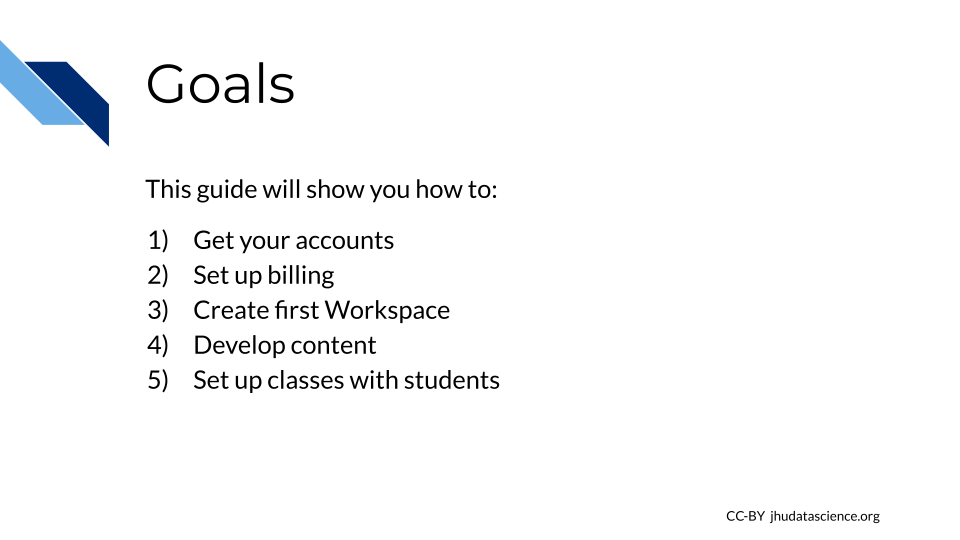

# Introduction

## What Is AnVIL?

AnVIL is NHGRI's Genomic Data Science Analysis, Visualization, and Informatics Lab-Space.  It provides a platform for performing genomic data analysis on the cloud.

<iframe width="560" height="315" src="https://www.youtube.com/embed/XC5qzj-yZb8" title="YouTube video player" frameborder="0" allow="accelerometer; autoplay; clipboard-write; encrypted-media; gyroscope; picture-in-picture" allowfullscreen></iframe>

## Does AnVIL Cost Money?

Through AnVIL, you pay for computing resources as you use them.  If you'd like to try it out, new users can claim a $300 Google Cloud credit to test out the platform and perform some small analyses.

We also provide a [cost estimator](https://jhudatascience.org/AnVIL_Book_Getting_Started/pis-and-lab-managers.html#types-of-costs).

## Where Can I Get Help?

Please visit our community support forum at [`help.anvilproject.org`](https://help.anvilproject.org) with any questions (or suggestions!) you may have.

You can also visit the [Getting Started Guide](https://jhudatascience.org/AnVIL_Book_Getting_Started/) and [`anvilproject.org/learn`](https://anvilproject.or/learn) for additional resources.

## Activate `scroll_highlight` Feature {#scroll-highlight}

Note that some sections of this book cover steps in a lot of detail. When navigating the table of contents, you can click subsection (e.g., 2.2, 4.2) headers a second time to expand the table of contents and enable the `scroll_highlight` feature. This can help you follow the separate steps within more clearly.

## Why should I use AnVIL?

You may be wondering if AnVIL is a good choice for your class. We feel the answer is an unequivocal YES!

AnVIL provides all the advantages of a cloud computing environment:

- **Version control**:  All students will be using the exact same versions of programs, running on the exact same operating system, and the majority of setup can be handled for the students ahead of time.  This greatly reduces time spent on setup and prevents unexpected run errors during the activities, limiting the amount of troubleshooting you have to do.  As a result, classes and activities will run more smoothly and predictably.
- **Inclusivity**: Cloud-computing enables all students to participate in the activity without needing to provide computers with certain specifications.
- **Experience**: Cloud-computing is becoming common in today’s bioinformatics workplaces, and the classroom is a low-stress and low-stakes opportunity for students to gain experience.

AnVIL is purpose-built for genomic data science:

- **Tools**: Through AnVIL, students can access a wide range of tools (Galaxy, RStudio/Bioconductor, Jupyter, as well as scripted workflows) all in one place, and can easily transition between them.
- **Datasets**: AnVIL provides a large and growing collection of relevant datasets with standardized organization, for easier importing and processing.
- **Authenticity**: On AnVIL, students will be working in the same environment as scientists carrying out cutting edge research.

## Overview

This book is targeted towards people who are teaching a course or workshop on AnVIL. You will find here:

- **Introduction** -- Design philosophy and goals for this guide - is this a good fit for your class?  What should you know before you start?
- **Instructor Setup** -- Step-by-step instructions to create your first accounts on AnVIL 
- **Content Preparation** -- Instructions on using premade content, along with additional tools to help you customize or create your own class Workspace
- **Running the Class** -- Step-by-step instructions to help you add students into a class on AnVIL, along with best practices for shutting down your course cleanly and minimizing costs
- **Cost Management** -- Explanations of the types of costs you and your students may incur, along with advice on how to minimize them.
- **Student Instructions** -- Step-by-step instructions for students using AnVIL in your class, to guide them through common tasks.

## Goals for This Guide

## Design Philosophy

This guide provides an opinionated walkthrough on how to set up AnVIL for your class.  These step-by-step instructions take instructors that are completely new to the AnVIL through account setup to the point where you can feel comfortable hosting a class from start-to-finish on AnVIL. Following the recommendations in this guide will help you minimize expenses, develop content programmatically, track individual student expenses, and stop billing expenses from accruing once the class is complete. In support of these goals we have made the following design decisions:

1. ACCOUNT SETUP

a. Sign up for a personal Google Cloud Account, where you can get started by claiming [$300 free Google credits](https://cloud.google.com/free/docs/gcp-free-tier/#free-trial).

2. CONTENT DEVELOPING

a. Include version control and visibility of course content by using GitHub. This will allow you to add content programmatically, keep track of changes, and share your content with others outside of AnVIL.

3. CLASS SETUP

a. Create a separate Terra Billing Project for each class. This will allow you to easily shut down expenses at the end of the class.
b. Choose one funding source per class (for example, the [STRIDES](#strides-funding) Program).
