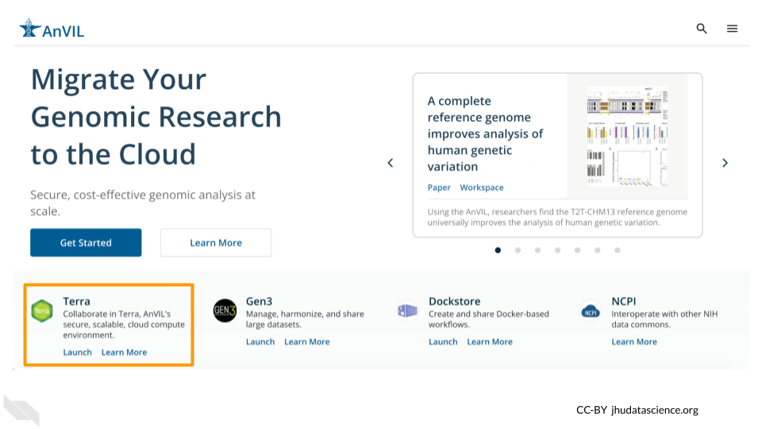
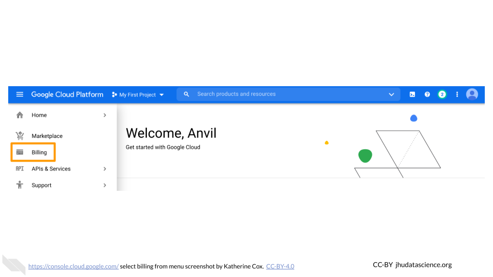
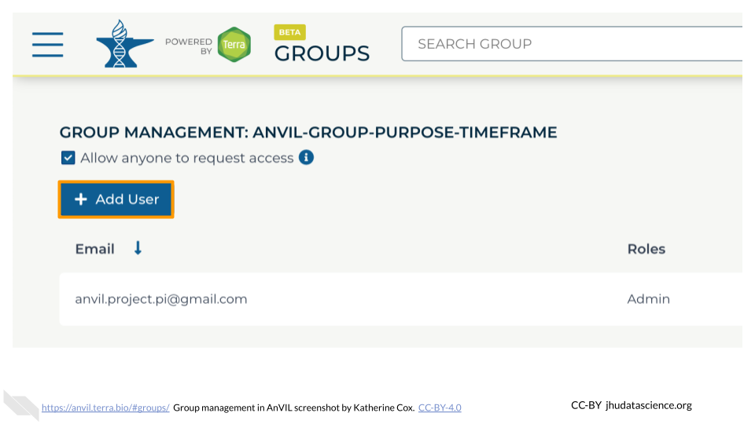
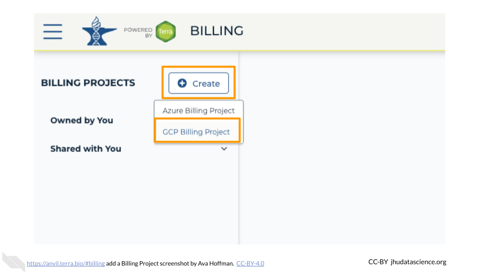
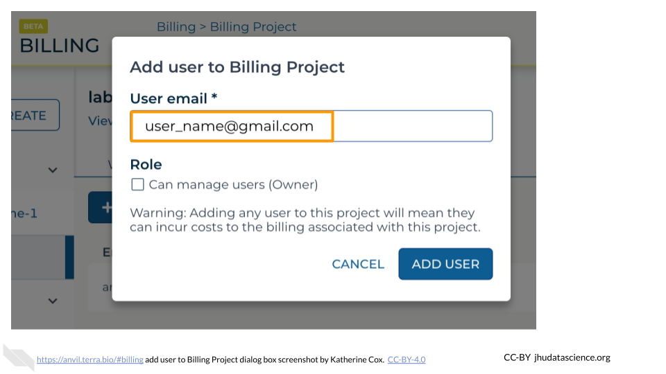

# (PART\*) Instructor Setup {-}

# Overview 

 

The setup instructions are presented in two parts:

- **Instructor Setup** (this section): covers everything needed to set up yourself and any co-instructors or TAs to work on AnVIL.  Depending on your team and funding, *you may only need to do these steps once* (and then make updates on an as-needed basis for changes in team members or funding).
- [**Running the Class**](#run-class): covers how to grant your students access to AnVIL.  These steps will need to be *repeated for each new offering of the course*.

## What do I need to do?

You may not need to do everything in the instructor setup section!

This section contains instructions for setting up billing from scratch.  If your funding is being managed by a third party (e.g. through a funding mechanism such as [STRIDES](https://datascience.nih.gov/strides) or through your institution) you can skip some steps.  The table below provides guidance on which steps you will need to complete:

| Task | Self-managed Funding | 3rd-party Funding |
|:----|:---:|:----:| 
|[Create Google Account](#instructor-google-account)|Yes|Yes|
|[Set up Google Billing](#google-billing-account)|Yes|Probably No (ask your funding manager)|
|[Create Instructor/TA Group](#instructor-group)| Only if you have co-instructors or TAs|Only if you have co-instructors or TAs|
|[Set up Terra Billing Projects](#terra-billing-projects)|Yes|Probably Yes (ask your funding manager)|

# Create Google account {#instructor-google-account}

AnVIL uses [Terra](https://anvil.terra.bio/) to run analyses. Terra operates on Google Cloud Platform, so you’ll pay for all storage and analysis costs through a Google account linked to Terra. The costs are the standard Google Cloud Platform fees for storing and moving data as well as executing an analysis. These costs are passed along through Terra without any markup.

## Create a Google Account {#google-account}

Terra operates on Google Cloud Platform, so you will need a (free) Google account which will allow you to access the Terra platform to manage students and in-class analyses.

Your Google account will also (1) allow you to manage billing yourself or (2) allow a Program Manager to do so on your behalf.

If you do not already have a Google account that you would like to use for accessing Terra, [create one now](https://accounts.google.com/SignUp). Otherwise, please use a Gmail account you have already set up.

If you would like to create a Google account that is associated with your non-Gmail, institutional email address, follow [these instructions](https://support.terra.bio/hc/en-us/articles/360029186611).

## Sign in to Terra

You need to sign into Terra to allow Billing Project managers to add you to projects and/or Workspaces. [Launch Terra](https://anvil.terra.bio/#workspaces), and you should be prompted to sign in with your Google account.

You can always access Terra by going to [`anvil.terra.bio`](https://anvil.terra.bio/), or by clicking the link on the AnVIL home page.

# Set up Google Billing {#google-billing-account}

Google Billing Accounts are how you pay Google for you and your students' cloud costs.  Depending on how you are being funded, this may be taken care of for you. If your funding is being managed by a third party (e.g. through a funding mechanism such as [STRIDES](https://datascience.nih.gov/strides), or through your institution), contact them to determine whether you need to do any billing administration through Google.  If not, you can proceed directly to [create Instructor Group](#instructor-group).

::: {.warning}

If you are new to AnVIL, **we strongly recommend seeking funding through NHGRI / STRIDES for teaching your course**.  In order to prevent abuse, Google sets certain limits on cloud resources available to new users that can complicate teaching (e.g. [project quotas](https://support.terra.bio/hc/en-us/articles/6101030164507-When-workspace-creation-fails-Google-project-quotas)).  As you or your institution builds a payment history with Google, the limits on your accounts will be relaxed.  In the meantime, STRIDES funding can help ensure your initial classes run smoothly.

**What is STRIDES?**  NHGRI's [strategic vision](https://pubmed.ncbi.nlm.nih.gov/33116284/) highlights the importance of training the next generation of genomic scientists.  In collaboration with the NIH Office of Data Science Strategy, NHGRI makes funding available to AnVIL users through the [STRIDES](https://datascience.nih.gov/strides) program, which aims to promote biological research in cloud environments. 

**To inquire about funding your class on AnVIL, please contact help@lists.anvilproject.org.**
:::

If you are using a third party funding mechanism but you would like to get started exploring AnVIL right away, you can optionally follow the instructions below to activate Google's free credits.  These should be sufficient for you to experiment with a few exercises yourself and learn how AnVIL works, while you work on getting funding set up for your class.

## Before You Start

- If you are managing your own billing, you will need a **credit card or bank account** to get started.  Google provides a free trial for first-time users, but payment information is still needed for verification purposes. Don't worry!  If using the free trial, **you won't be billed until you explicitly turn on automatic billing**.
- Before setting up billing yourself, you may want to check with your institutional procurement office and see if they have a preferred account set-up method with Google (such as a third party reseller or an existing account).

## Google Billing Account

AnVIL operates on Google Cloud Platform, and does not charge any markup.  Rather than paying Terra or AnVIL, users set up billing directly with Google Cloud Platform.

**Make sure to use the same Google account ID you use to log into Terra for Google Cloud Billing.**

To set up billing, you must first create a **Google “Billing Account”**.

:::{.notice}
**Tip**:  You can create multiple Billing Accounts associated with your Google ID.

- A single Billing Account can fund multiple courses, sections, or iterations of a course, as long as they have a common funding source.
- But, if courses are funded separately, we recommend creating separate Billing Accounts
:::

### Create a Google Billing Account

1. Log in to the [Google Cloud Platform](https://console.cloud.google.com/) console using your Google ID. **Make sure to use the same Google account ID you use to log into Terra.**  

1. If you are a first time user, don’t forget to claim your free credits! If you haven't been to the console before, once you accept the Terms of Service you will be greeted with an invitation to "Try for Free."

    

1. Follow the instructions to sign up for a Billing Account and get your credits. 

1. Choose “Individual Account”. This “billing account” is just for managing billing, so you don’t need to be able to add your team members. You will need to give either a credit card or bank account for security. Don't worry! **You won't be billed until you explicitly turn on automatic billing**.

    

1. You can view and edit your new Billing Account, by selecting “Billing” from the left-hand menu, or going directly to the billing console [console.cloud.google.com/billing](https://console.cloud.google.com/billing) 

    

1. Clicking on the Billing Account name will allow you to manage the account, including accessing reports, setting alerts, and managing payments and billing.

    

At any point, you can create additional Billing Accounts using the **Create Account** button.  We generally recommend creating a new Billing Account for each funding source.

### Add Users or Viewers (optional)

If you have a finance administrator who needs access to a Billing Account, you can add them with a few different levels of permissions.  Generally the most useful are:

- **Users** have a great deal of power over spending - they can create new "Billing Projects" and control who can spend money on those projects.  If you have an accounts manager responsible for expenses, it may make sense to add them as a Billing Account User.  If you wish to retain full control over who can spend money, you should not add any Users.
- **Viewers** can see the activity in the Billing Account but can’t make any changes.  This can be useful for finance staff who need access to the reports, or for anyone who needs to monitor spending.

Anyone you wish to add to the Billing Account will need their own Google ID.

To add a member to a Billing Project:
  
1. Log in to the [Google Cloud Platform](https://console.cloud.google.com/) console using your Google ID.
1. Navigate to [Billing](https://console.cloud.google.com/billing)

    

1. You may be automatically directed to view a specific Billing Account.  If you see information about a single account rather than a list of your Billing Accounts, you can get back to the list by clicking "Manage Billing Accounts" from the drop-down menu.

    

1. Check the box next to the Billing Account you wish to add a member to, click "ADD MEMBER".

    

1. Enter their Google ID in the text box. In the drop-down menu, mouse over Billing, then choose the appropriate role.

    

1. Click "SAVE".

    

## Add Terra to Google Billing Account

This gives Terra permission to create projects and send charges to the Google Billing Account, and must be done by an administrator of the Google Billing Account.

Terra needs to be added as a "Billing Account User":

1. Log in to the [Google Cloud Platform](https://console.cloud.google.com/) console using your Google ID.
1. Navigate to [Billing](https://console.cloud.google.com/billing)

    

1. You may be automatically directed to view a specific Billing Account.  If you see information about a single account rather than a list of your Billing Accounts, you can get back to the list by clicking "Manage Billing Accounts" from the drop-down menu.
 
    

1. Check the box next to the Billing Account you wish to add Terra to, click "ADD MEMBER".

    

1. Enter `terra-billing@terra.bio` in the text box.  In the drop-down menu, mouse over Billing, then choose "**Billing Account User**".

    

1. Click "SAVE".

    

# Create Instructor Group {#instructor-group}

Groups enable you to share AnVIL resources and manage permissions for many people at once.  If you have co-instructors or TAs who will be teaching with you, we recommend setting up an "instructor" Group where you can share materials under development and any other resources that are not meant to be shared with students.  If you are teaching by yourself, you can proceed directly to [Terra Billing Projects](#terra-billing-projects).

:::{.notice}
Depending on your needs, you may want to

- Create a single Group that persists across course offerings.  This is convenient if the same people will be teaching the course multiple times; you will not have to re-share resources each time.
- Create a new Group for each offering of the course.  This can be useful if you have different TAs for every offering and you don't want them to access materials and funding for past and future offerings.

You can always add/remove Groups and Group members later, so we recommend starting out with a single instructor group.  You can decide later if you want to create a new Group for the next course.
:::

Choose an informative, unique Group name. We suggest a combination of institution-class-role (e.g., `jhu-bio101-instructors`). Only letters, numbers, underscores, and dashes are allowed in Group names.

## Create Terra Group

To create a Group:

::::{.borrowed_chunk}

1. [Launch Terra](https://anvil.terra.bio/#workspaces) and sign in with your Google account.

1. In the drop-down menu on the left, navigate to "Groups". Click the triple bar in the top left corner to access the menu. Click the arrow next to your name to expand the menu, then click "Groups".  You can also navigate there directly with this link: https://anvil.terra.bio/#groups

    

1. Click "+ Create a New Group"

    

1. Enter a name for your group.  Names must be unique, so it’s often helpful to include your team’s name, the purpose of the group, and optionally the timeframe, if you will have similar groups in the future.

    

1. Click "CREATE GROUP"

    

1. Your new Group should now show up on the Group Management screen.  Take note of the email address associated with your group.  You will use this email to grant the group access to Billing Projects and Workspaces.

    
::::

You now have a unique **instructor Group**.

## Add Instructors and TAs to Group

Now that your instructor Group has been created, you should add any additional instructors and TAs. You should also ensure that they have the correct permissions.

:::{.notice}
Users can be added to a Group as either **Admins** or **Members**.  Admins can add and remove members from the group.

Group roles only affect whether or not someone can add and remove members from the Group.  They do not grant special privileges with respect to Terra resources (Billing Projects and Workspaces).

However, an Admin for the Group can *indirectly* grant access to Terra resources.  By adding someone to the Group, they grant that person access to any Terra resources that the Group has been given permission to access.
:::

Often it's appropriate to add any **co-instructors as Admins, with TAs as Members**.

To add someone to your group:

:::: {.borrowed_chunk}

1. [Launch Terra](https://anvil.terra.bio/#workspaces) and sign in with your Google account.

1. In the drop-down menu on the left, navigate to "Groups". Click the triple bar in the top left corner to access the menu. Click the arrow next to your name to expand the menu, then click "Groups".  You can also navigate there directly with this link: https://anvil.terra.bio/#groups

    

1. Find the name of the Group you want to add someone to, and confirm that you have Admin privileges for the Group (you can only add and remove members to a Group if you are an Admin).  Click on the name of the Group to view and manage members.

    

1. Click on "+ Add User". You will be prompted to enter the user’s AnVIL ID.

    

1. Type in the user’s email address.  Make sure this is the account that they will be using to access AnVIL.

    

1. If this member will need to add and remove other members of the Group, check the box for "Can manage members (admin)".  This will add them as an "Admin" for the Group.  Otherwise leave it unchecked, and they will be added as a "Member".
     - Admins and Members have equal access to any resources shared with the Group.
     - Admins can manage Group membership - they can add, remove, or change the role of other Group members.

    

1. Click ADD USER. This will take you back to the Group administration page.

    
    
1. The new Group member will now be shown in the list of group members, along with their role.  They should now have access to anything that the Group has been given access to.

    

If you need to remove members or modify their roles, you can do so at any time by clicking the teardrop button next to their name.

::::

# Set up Terra Billing Projects {#terra-billing-projects}

Terra Billing Projects are how you grant people (including yourself!) permission to compute on AnVIL.  By adding someone to your Billing Project, you enable them to use your funding to carry out activities on AnVIL.

Depending on how you are being funded, this may be taken care of for you. If your funding is being managed by a third party (e.g. through a funding mechanism such as [STRIDES](https://datascience.nih.gov/strides), or through your institution), contact them to determine whether you should create Terra Billing Projects yourself.

The first set of instructions below walk you through creating a Terra Billing Project.  **If someone else has provided a billing project**, you can skip down to [adding instructors to Billing Project](#add-instructors-billing-project).

## Create Terra Billing Projects

::: {.warning}
To create a Billing Project, you need access to a Google Billing Account.

- If you set up Google Billing yourself, you're good to go!  Just make sure to use the same Google Account when logging in to Terra.
- If a third party is handling Google Billing, you likely do not need to log in to Google Billing yourself; you should be able to follow the instructions below to create a Billing Project within Terra.  If you run into trouble, check with your funding manager to confirm:
    - They have set up a Google Billing Account
    - They have added you to the Account as a "User" (or higher)
    - You are using the correct Google ID (i.e. email address) to log in to Terra
    - They have not already created a Billing Project for you
:::

It's often beneficial to set up two separate Billing Projects for a course:

1. **Instructor/TA** - used to fund development and testing of the material.  It can persist for multiple sessions of the course.
2. **Student** - funds all student activity, and is deactivated at the end of the course activities.

Having separate Billing Projects is not required, but can make management easier, particularly when it comes to shutting things down.

**Note:** Terra Billing Projects need unique names.  One option is to use a combination of institution-class-term (e.g. `jhu-bio101-2022SP`).

To create a Terra Billing Project:

:::: {.borrowed_chunk}

1. [Launch Terra](https://anvil.terra.bio/#workspaces) and sign in with your Google account.  If this is your first time logging in to Terra, you will need to accept the Terms of Service.

1. In the drop-down menu on the left, navigate to "Billing". Click the triple bar in the top left corner to access the menu. Click the arrow next to your name to expand the menu, then click "Billing".  You can also navigate there directly with this link: https://anvil.terra.bio/#billing

    

1. On the Billing page, click the "+ CREATE" button to create a new Billing Project. If prompted, select the Google account to use.  If prompted, give Terra permission to manage Google Cloud Platform billing accounts.

    

1. Enter a **unique** name for your Terra Billing Project and select the appropriate Google Billing Account. The name of the Terra Billing Project must:
    + Only contain lowercase letters, numbers and hyphens
    + Start with a lowercase letter
    + Not end with a hyphen
    + Be between 6 and 30 characters

    
    
1. Select the Google Billing Account to use.  All activities conducted under your new Terra Billing Project will charge to this Google Billing Account.  If prompted, give Terra permission to manage Google Cloud Platform billing accounts.

    

1. Click "CREATE BILLING PROJECT".

    

1. Your new Billing Project should now show up in the list of Billing Projects Owned by You.  You can add additional members or can modify or deactivate the Billing Project at any time by clicking on its name in this list.

    

The page doesn't always update as soon as the Billing Project is created.  If it's been a couple of minutes and you don't see a change, try refreshing the page.
::::

## Add Instructors to Billing Project {#add-instructors-billing-project}

Adding someone to a Billing Project enables them to compute on AnVIL, funded by the Billing Project.

::: {.warning}
To add members to a Billing Project, you must be an "Owner" of the Billing Project.

- If you created the Billing Project yourself, you're good to go!
- If a third party created the Billing Project, check to see whether you are an Owner or a User.  If you are not an Owner, you will need to contact your funding manager.  They can either make you an Owner, or can add other team members to the Billing Project themselves.
:::

You can add individual users to a Billing Project, or you can add a Terra Group, which will enable everyone in the Group to charge to the Billing Project.

- To add an individual user, you will need to know the email address they will be using to access AnVIL.
- To add a Group, you will need the email address associated with the Group.

### Find Group email {#group-email}

If you want to add a Terra Group (such as your "instructor" Group) to your Billing Project, you can find the Group email address on the Group Managment page:

1. [Launch Terra](https://anvil.terra.bio/#workspaces) and sign in with your Google account.

1. In the drop-down menu on the left, navigate to "Groups". Click the triple bar in the top left corner to access the menu. Click the arrow next to your name to expand the menu, then click "Groups".  You can also navigate there directly with this link: https://anvil.terra.bio/#groups

    

1. Find the name of the Group, then look in the "Group Email" column to find the email address associated with the Group.  Copy this email address and paste it in as the username when adding people to Billing Projects and Workspaces.  This will grant everyone in the Group access to the Billing Project or Workspace.

    

Now that you have the Group email address, you can add the group to your Billing Project.

### Add members to Billing Project

:::{.notice}
Users can be added to a Billing Project as either **Owners** or **Users**.  Owners can add and remove users from the Billing Project (including other Owners!).  This means Billing Project Owners have a great deal of power over how money can be spent.

It’s often a good idea to have at least one other Owner of a Billing Project in order to avoid getting locked out, in case the original Owner leaves or loses access to their account.  But you should exercise caution when selecing Billing Project Owners.

When teaching with a team, it may make sense to add only those most comfortable with Terra and/or most involved in Terra administration as Owners, and to add everyone else as Users.  This can be done by adding the Owners individually as Owners, and then adding the Instructor Group as User.
:::

:::: {.borrowed_chunk}

1. [Launch Terra](https://anvil.terra.bio/#workspaces) and sign in with your Google account.

1. In the drop-down menu on the left, navigate to "Billing". Click the triple bar in the top left corner to access the menu. Click the arrow next to your name to expand the menu, then click "Billing".  You can also navigate there directly with this link: https://anvil.terra.bio/#billing

    

1. Click “Owned by You” and find the Billing Project.  If you do not see the Billing Project in this list, then you are not an Owner and do not have permission to add members.

    

1. Click on the name of the Billing Project.

    

1. Click on the “Members” tab to view and manage members.  Then click the “Add User” button.

    
    
1. Enter the email address of the user or group you’d like to add the the Billing Project.
    - If adding an individual, make sure to enter the account that they use to access AnVIL.
    - If adding a Terra Group, use the Group email address, which can be found on the Terra Group management page.

    

1. If this user or group will need to add and remove other users of the Billing Project, check the Owner box.  Otherwise leave it unchecked.
    - It’s often a good idea to have at least one other Owner of a Billing Project in order to avoid getting locked out, in case the original owner leaves or loses access to their account.

    

1. Click “ADD USER”.

    

1.  You should now see the user or group listed in the Billing Project members, along with the appropriate role.  They should now be able to use the Billing Project to fund work on AnVIL.

    
    
If you need to remove members or modify their roles, you can do so at any time by clicking the teardrop button next to their name.

::::

# Wrap-up

**Congratulations! You have successfully set up AnVIL for your teaching team!**

You and your team members should be free to develop and test content, funded by your Billing Project.  Check out the *Content Preparation* section for more information about how to use or develop content on AnVIL.

When you're ready to set things up for your students

- [**Running the Class**](#run-class) has instructions on getting everything set up to teach your course or workshop
- [**Student Instructions**](#student-instructions) has student-facing instructions that you can share with your students so they can sign up for an AnVIL account and access any necessary resources
