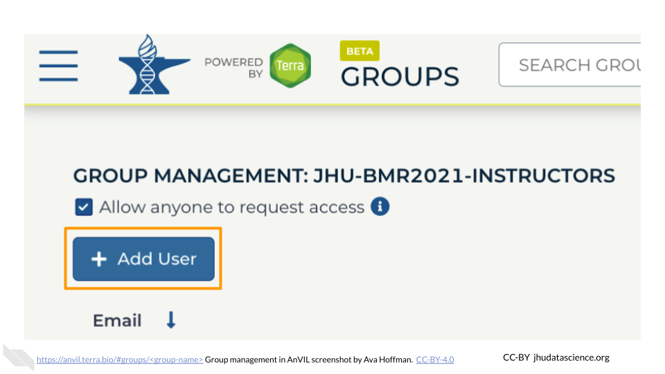
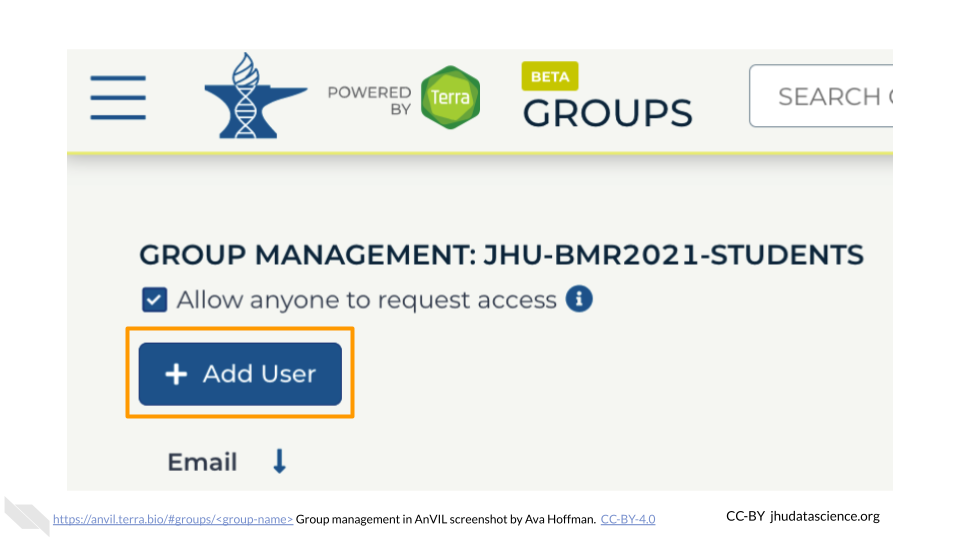
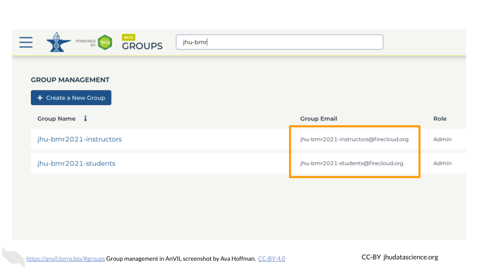

# (PART\*) User Setup {-}

# Creating an instructor account

AnVIL uses [Terra](https://anvil.terra.bio/) to run analyses. Terra operates on Google Cloud Platform, so you’ll pay for all storage and analysis costs through a Google account linked to Terra. The costs are the standard Google Cloud Platform fees for storing and moving data as well as executing an analysis. These costs are passed along through Terra without any markup.

## Create a Google Account {#google-account}

Terra operates on Google Cloud Platform, so you will need a (free) Google account which will allow you to access the Terra platform to manage students and in-class analyses.

Your Google account will also (1) allow you to manage billing yourself or (2) allow a Program Manager to do so on your behalf.

If you do not already have a Google account that you would like to use for accessing Terra, [create one now](https://accounts.google.com/SignUp). Otherwise, please use a Gmail account you have already set up.

If you would like to create a Google account that is associated with your non-Gmail, institutional email address, follow [these instructions](https://support.terra.bio/hc/en-us/articles/360029186611).

## Sign in to Terra

You need to sign into Terra to allow Billing Project managers to add you to projects and/or Workspaces. [Launch Terra](https://anvil.terra.bio/#workspaces), and you should be prompted to sign in with your Google account.

You can always access Terra by going to [`anvil.terra.bio`](https://anvil.terra.bio/), or by clicking the link on the AnVIL home page.

# Creating and adding student accounts

Since Terra operates on Google Cloud Platform, students need a Google account to make sure you can keep track of any computing costs they accrue. 

## Have students create a Google Account

If you do not already have a Google account that you would like to use for accessing Terra, [create one now](https://accounts.google.com/SignUp). Otherwise, please use a Gmail account you have already set up.

If you would like to create a Google account that is associated with your non-Gmail, institutional email address, follow [these instructions](https://support.terra.bio/hc/en-us/articles/360029186611).

## Have students sign in to Terra

Students need to sign into Terra with their Google account to allow you the  instructor to add them to projects and/or Workspaces associated with your specific class. This is the only way students can launch applications and perform computations on AnVIL. Have students [launch Terra](https://anvil.terra.bio/), and they should be prompted to sign in with your Google account.

::: {.warning}
**Collect Accounts**: It is _very important_ students share the Google account they used above with you! Otherwise, you cannot add them to billing projects, groups, or Workspaces.
:::

Students can always access Terra by going to [`anvil.terra.bio`](https://anvil.terra.bio/), or by clicking the link on the AnVIL home page.

# Groups for easy management

Groups enable you to share your class Workspace and manage permissions for many people at once. We recommend starting with one Group for instructors and one Group for students.

## Instructor Group {#instructor-group}

Create an informative, unique Group name for any co-instructors and teaching assistants. We suggest a combination of institution-class-role (e.g., “jhu-bmr2021-instructors”). Only letters, numbers, underscores, and dashes are allowed in Group names. To create a Group for instructors:

1. Go to [https://anvil.terra.bio/#groups](https://anvil.terra.bio/#groups)

1. Click “+ Create a New Group”

    

1. Type in your instructor Group name

1. Click “CREATE GROUP”

    

You now have a unique **instructor Group**.

### Add Instructors as "Admin" (Instructor Group)

Now that your instructor Group has been created, you should add any additional instructors. You should also ensure that they have the correct permissions. 

1. Go to https://anvil.terra.bio/#groups/ and click on the instructor Group name. This page should also be visible at `https://anvil.terra.bio/#groups/<group-name>`.

    

1. Click on “+Add User”. You will be prompted to add the instructor’s AnVIL ID. 

    

1. Type in the instructor’s AnVIL ID

    

1. Make sure “Can manage users (admin)” is **selected**

    

1. Click ADD USER. This will take you back to the Group administration page.

    

Make sure the newly added instructor displays “Admin” under “Roles” beside their AnVIL ID. Repeat this process for any additional co-instructors and teaching assistants.

## Student Group {#student-group}

Next, you will create a Group for your students. Create an informative, unique Group name. We suggest a combination of institution-class-role (e.g., “jhu-bmr2021-students”). Only letters, numbers, underscores, and dashes are allowed in Group names. To create a Group for students:

1. Go to https://anvil.terra.bio/#groups

1. Click “+ Create a New Group”

    

1. Type in your student Group name

1. Click “CREATE GROUP”

    

You now have a unique **student Group**.

### Add Instructors as "Admin" (Student Group)

The next steps ensure any additional co-instructors and teaching assistants are able to administer the student Group in case you are unavailable. Follow the steps below to add each co-instructor in the student Group:

1. Go to https://anvil.terra.bio/#groups/ and click on the student Group name. This page should be visible at `https://anvil.terra.bio/#groups/<group-name>`.

    

1. Click on “+Add User”. You will be prompted to add the instructor’s AnVIL ID. 

    

1. Type in the instructor’s AnVIL ID

    

1. Make sure “Can manage users (admin)” is **selected**

    

1. Click ADD USER. This will take you back to the Group administration page.

    

Make sure the newly added instructor displays “Admin” under “Roles” beside their AnVIL ID. Repeat this process for any additional co-instructors and teaching assistants.

### Add Students as "Member"

Follow the steps below to add individual students to the student Group:

1. Go to https://anvil.terra.bio/#groups/ and click on the student Group name. This page should be visible at `https://anvil.terra.bio/#groups/<group-name>`.

    

1. Click on “+Add User”. You will be prompted to add an AnVIL ID. 

    

1. Type in the student’s AnVIL ID

    

1. Click ADD USER

    

Make sure the newly added student displays “Member” under “Roles” beside their AnVIL ID. At present, each student’s AnVIL ID must be added separately.

Your instructor and student Groups are now set up.

## Group Email Lists

Note that your newly created Groups have Group emails associated with them. Take note of these Group emails. You will use them for granting access to your class Billing Projects and Workspaces. It saves you from having to add or revoke access to students one by one.

