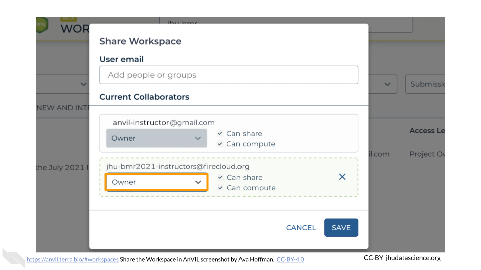

# (PART\*) Content Preparation {-}


# Using premade content

This chapter will help you get started with the premade class activities available through AnVIL. Activities currently available are listed on the home page of this guide.

::: {.notice}
**Notify Terra**

Contacting Terra ahead of your class time helps the Terra team avoid any major disruptions to your class. Contact Terra by [submitting a request](https://support.terra.bio/hc/en-us/requests/new) for a hold on scheduled maintenance and downtime. It’s also a good idea to ask about major changes planned for the time prior to your class.
:::

## Before You Start

1. You need to **set up [Billing](#billing-project)**. This includes your Google Billing Account and Terra Billing Project. Take note of your Terra Billing Project name.

1. If you are running one of the activities that uses RStudio, you should **launch RStudio** using the Community-Maintained RStudio Environment. This requires you to be familiar with [RStudio on AnVIL](#starting-rstudio).

1. **Notify Terra**. Contacting Terra ahead of your class time helps the Terra team avoid any major disruptions to your class. Contact Terra by [submitting a request](https://support.terra.bio/hc/en-us/requests/new) for a hold on scheduled maintenance and downtime. It’s also a good idea to ask about major changes planned for the time prior to your class.

## Cloning the workspace

Workspaces are the building blocks of projects in Terra. Inside a Workspace, you can run analyses, launch interactive tools like RStudio and Galaxy, store data, and share results. 

Cloning the workspace associated with one of the premade AnVIL activities gives you access to all the necessary data. When cloning, AnVIL makes a copy of notebooks and code for you to modify. Data however, is linked back to the original Workspace through Data Tables, which saves space!

The video below gives a brief introduction to the parts of a Workspace.

<iframe src="https://drive.google.com/file/d/18WUmQfDnulHdaMlrH0Eh6kwIP3zTkaqp/preview" width="640" height="360" allow="autoplay"></iframe>


1. [Launch Terra](https://anvil.terra.bio/#workspaces)

1. Locate the Workspace you want to clone. If a Workspace has been shared with you ahead of time, it will appear in "MY WORKSPACES". You can clone a Workspace that was shared with you to perform your own analyses. In the screenshot below, no Workspaces have been shared.

    

1. If a Workspace hasn't been shared with you, navigate to the "FEATURED" or "PUBLIC" Workspace tabs.

    
    
1. Use the search box to find the Workspace you want to clone.

    
    
1. Click the teardrop button on the far right next to the Workspace you want to clone. Click "Clone". You can also clone the Workspace from the Workspace Dashboard instead of the search results.

    
    
    
1. You will see a popup box appear. Name your Workspace and select the appropriate Terra Billing Project.  **All activity in the Workspace will be charged to this Billing Project** (regardless of who conducted it). Remember that each Workspace should have its own Billing Project.

    

1. If you are working with protected data, you can set the **Authorization Domain** to limit who can be added to your Workspace.  Note that the Authorization Domain cannot be changed after the Workspace is created (i.e. there is no way to make this Workspace shareable with a larger audience in the future).  Workspaces by default are only visible to people you specifically share them with.  Authorization domains add an extra layer of enforcement over privacy, but by nature make sharing more complicated.  We recommend using Authorization Domains in cases where it is extremely important and/or legally required that the data be kept private (e.g. protected patient data, industry data).  For data you would merely prefer not be shared with the world, we recommend relying on standard Workspace sharing permissions rather than Authorization Domains, as Authorization Domains can make future collaborations, publications, or other sharing complicated.

    
    
1. Click "CLONE WORKSPACE".  The new Workspace should now show up under your Workspaces.

    


# Developing your own content

This chapter will show you how to publish a Workspace on AnVIL using RStudio. Publishing Workspaces programmatically makes it easier to incorporate version control (e.g., using [git](https://git-scm.com/)) and ensures that all of your notebook files end up in the Workspace.

Much of the information in this section comes from the [AnVILPublish vignette](https://bioconductor.org/packages/release/bioc/vignettes/AnVILPublish/inst/doc/AnVILPublishIntro.html), which can serve as an additional reference.

::: {.notice}
**Notify Terra**

Contacting Terra ahead of your class time helps the Terra team avoid any major disruptions to your class. Contact Terra by [submitting a request](https://support.terra.bio/hc/en-us/requests/new) for a hold on scheduled maintenance and downtime. It’s also a good idea to ask about major changes planned for the time prior to your class.
:::

### Before You Start

1. You need to set up [Billing](#billing-project). This includes your Google Billing Account and Terra Billing Project. Take note of your Terra Billing Project name.

1. Create your [first Workspace](#first-workspace). A first Workspace is needed to launch RStudio, but after that, all Workspaces can be made programmatically from within other Workspaces.

1. Launch RStudio using the Community-Maintained RStudio Environment. This requires you to be familiar with [RStudio on AnVIL](#starting-rstudio).

## Set Up AnVILPublish on AnVIL

### Install AnVILPublish

Install `AnVIL` and `AnVILPublish`. Don't worry about loading it for now. Tip: hover over the top-right corner of the box below to copy the code.


``` r
BiocManager::install("AnVIL")
AnVIL::install("AnVILPublish")
```

### Install `notedown`

Next, navigate to the RStudio Terminal and install [`notedown`](https://github.com/aaren/notedown) using `pip3`. This module converts markdown documents into `.ipynb` notebooks.


``` bash
pip3 install notedown
```

Return to the RStudio Console. RStudio doesn't automatically know where to look for `notedown`. Add the `notedown` installation to your RStudio PATH:


``` r
# Add to PATH
existing_path <- Sys.getenv("PATH")
notedown_path <- "/home/rstudio/.local/bin"
Sys.setenv(PATH = paste(existing_path, notedown_path, sep = ":"))
```

Confirm that `notedown` is ready to use:


``` r
# Confirm notedown is accessible
system2("notedown", "--version")
```

You should see the version number printed to the console:


## Create Workspace Structure

### Identify Your Repository

You need a folder with content to get started. In the next step, this will be the basic structure of your files:

```
AnVILPublishSkeleton
|-DESCRIPTION
|-LICENSE.md
|-NAMESPACE
|-README.md
|-vignettes
  |-Notebook_1.Rmd
```

"AnVILPublishSkeleton" is the name of the folder containing all of your information. The folder must contain a `DESCRIPTION` file, `NAMESPACE` file, and a `vignettes` directory with at least one `.Rmd` file. As you develop content, you might end up with many `.Rmd` notebooks inside the `vignettes` directory. We will practice with a basic set of files that are already set up for you on [GitHub](https://github.com/).

First, you should clone the [skeleton repository](https://github.com/avahoffman/AnVILPublishSkeleton).


``` bash
git clone https://github.com/avahoffman/AnVILPublishSkeleton
```

You'll notice it contains a `DESCRIPTION` file, `NAMESPACE` file, and a `vignettes` directory with an `.Rmd` file.


### Changing the `DESCRIPTION` File

Edit the information in `DESCRIPTION` but keep the structure the same.

1. `Package:` argument: This "package name" must match the name of the folder containing the `DESCRIPTION` and other files. In this case, it should be "AnVILPublishSkeleton".


2. `Title:` argument: This will become the header for your Workspace's Dashboard.


3. `Authors@R:` argument: Your author information and roles. At minimum, you should include a first name, family name, a role, and an email. You can add additional authors and roles as needed. See a more detailed guide to package metadata [here](https://r-pkgs.org/description.html#author). The most common roles are creator (`cre`), author (`aut`), and contributor (`ctb`), but there are [many more](https://www.loc.gov/marc/relators/relaterm.html) to choose from if none of these fit the bill.

```
Authors@R: 
    person(given = "Firstname",
           family = "Lastname",
           role = "cre",
           email = "firstnamelastname@gmail.com")
```

4. `Description:` argument: A several-sentence description of the project.

### Changing Other Files

Do not edit the `NAMESPACE` file. The `README.md` file and `.Rmd` file(s) will be discussed in more detail in [Update Dashboard].

### Create the Workspace

Use the `AnVILPublish::as_workspace()` function. Replace `<billing-project>` with the appropriate Terra Billing Project of your choosing. Replace `<My-Workspace>` with the Workspace name of your choosing.


``` r
AnVILPublish::as_workspace(
  path = "/home/rstudio/AnVILPublishSkeleton", # directory containing DESCRIPTION file
  namespace = "<billing-project>", # Billing project
  name = "<My-Workspace>", # Actual Workspace name
  create = TRUE # Makes a *new* Workspace
)
```

You will see output in the console as the function converts the `.Rmd` to `.md`. You might get some warning messages, but make sure that the Workspace was created without error:


You should now see this new Workspace at [`https://anvil.terra.bio/#workspaces`](https://anvil.terra.bio/#workspaces).


## Set Workspace permissions

Finally, you will want to set up permissions for co-instructors and students to see the class Workspace you created with the development Billing Project in [Developing Content](developing-content.html). AnVIL users can take on the "Owner", "Writer", or "Reader" role for a Workspace.

### Add Instructors as “Owner”

You should add your co-instructors and teaching assistants as “Owners” to the class Workspace. This is useful if they need to edit the course content or share the space with students on your behalf. To share and change permissions:

1. Go to https://anvil.terra.bio/#workspaces and find your class Workspace you set up in [Developing Content](developing-content.html)

1. Click the teardrop button for your class Workspace

1. Click “Share”. This will open a dialog box.

    

1. Enter the name of the instructor Group (e.g., jhu-bmr2021-instructors). This will create a dropdown for the Group permissions in the box. Select this Group.

    

1. Change permissions to “Owner” using the dropdown menu under the instructor Group

    

1. Click “SAVE”

    

::: {.fyi}
This step makes it so that co-instructors can edit the original content of the Workspace as needed. While this means you and co-instructors can compute using the development Billing Project, this makes spending difficult to track. Instructors should instead clone the Workspace using the **instructor Billing Project**. This makes it much easier to track costs associated with this iteration of your class versus further iterations (e.g., the following semester or year).
:::

### Add Students as “Reader”

Next, add your students as “Readers” to the class Workspace. This means they will be able to view and clone the Workspace, but not make edits or perform computations. To share the Workspace:

1. Click the teardrop button for your class Workspace

1. Click “Share”. This will open a dialog box.

    

1. Enter the name of the student Group. This will create a dropdown for the Group permissions in the box. Select this Group.

    

1. Ensure permissions are set to “Reader” (default)

    

1. Click “SAVE”

    

You have now correctly set up your class permissions!

## Update Dashboard

Edit the `README.md` file to add more details to your Workspace Dashboard page. You will use the same function you used to create the Workspace as to update it, with a small change. Instead of `create = TRUE` you’ll now see an argument `update = TRUE`. **Be very careful to use the correct Workspace name** here, so you don’t accidentally overwrite the wrong Workspace.


``` r
AnVILPublish::as_workspace(
  path = "/home/rstudio/AnVILPublishSkeleton", # directory containing DESCRIPTION file
  namespace = "<billing-project>", # Billing project
  name = "<My-Workspace>", # Actual Workspace name
  update = TRUE, # Updates the Workspace with your changes
  use_readme = TRUE # Use README file for Dashboard Description
)
```

You can also click the pencil button next to “ABOUT THE WORKSPACE” to edit the Dashboard manually, but these changes won’t show up later in GitHub. They will also be overwritten by other AnVILPublish updates.

## Post Jupyter Notebook

The `.Rmd` file contains your content. You can make many `.Rmd` files. These will get turned into `.ipynb` Jupyter Notebooks when you update using AnVILPublish. After you make changes to your `.Rmd` files, update the Workspace by running:


``` r
AnVILPublish::as_workspace(
  path = "/home/rstudio/AnVILPublishSkeleton", # directory containing DESCRIPTION file
  namespace = "<billing-project>", # Billing project
  name = "<My-Workspace>", # Actual Workspace name
  update = TRUE, # Updates the Workspace with your changes
  use_readme = TRUE # Use README file for Dashboard Description
)
```

Note that this is the same code used to update the Workspace Dashboard. You can use this exact code to update your workspace any time you save changes in RStudio!

## Push Changes to GitHub

Hosting your course's code on GitHub will ensure that it is reproducible, easy to update, and robust to any tweaks you make. After cloning the skeleton repository, you will need to make a few changes to ensure your content ends up associated with your GitHub account. This means you own it and can make/save changes!

Briefly, you should:

1. Create a new repository on [GitHub](https://github.com/new). Don't add a `README.md`, `.gitignore`, or license.

1. Return to RStudio on AnVIL and Initialize your `.Rproj`.

1. [`add`](https://git-scm.com/docs/git-add) and [`commit`](https://git-scm.com/docs/git-commit) your changes on AnVIL.  

1. [`rename`](https://git-scm.com/docs/git-remote) and [`add`](https://git-scm.com/docs/git-remote) a new origin that points to the new repository you just created.

1. [`push`](https://git-scm.com/docs/git-push) your changes. Remember that you will need to use a [GitHub Personal Token](https://docs.github.com/en/github/authenticating-to-github/keeping-your-account-and-data-secure/creating-a-personal-access-token) instead of your password.

Git can be challenging. Please reach out to our community network at [`help.anvilproject.org`](https://help.anvilproject.org/) for help.
