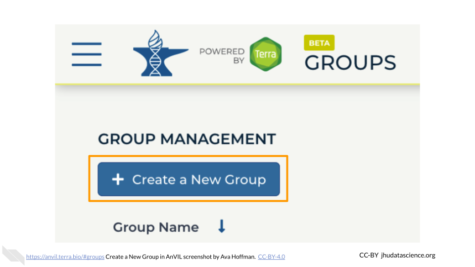
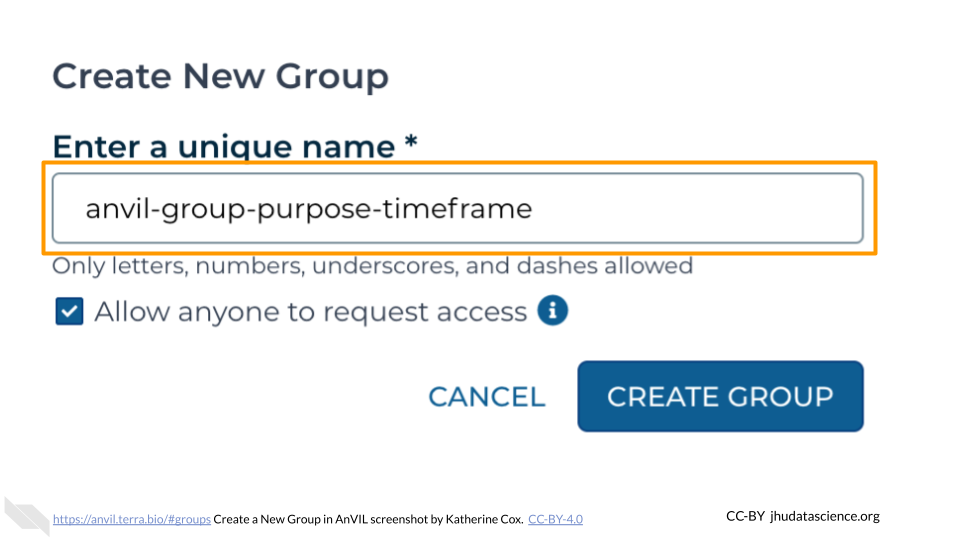
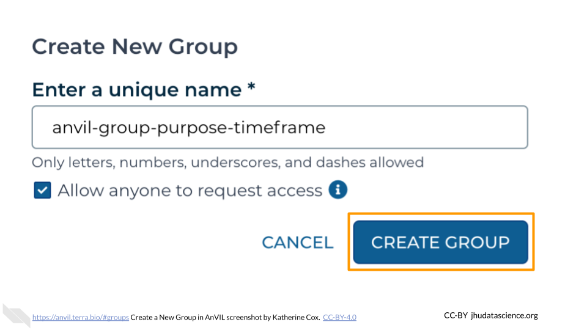
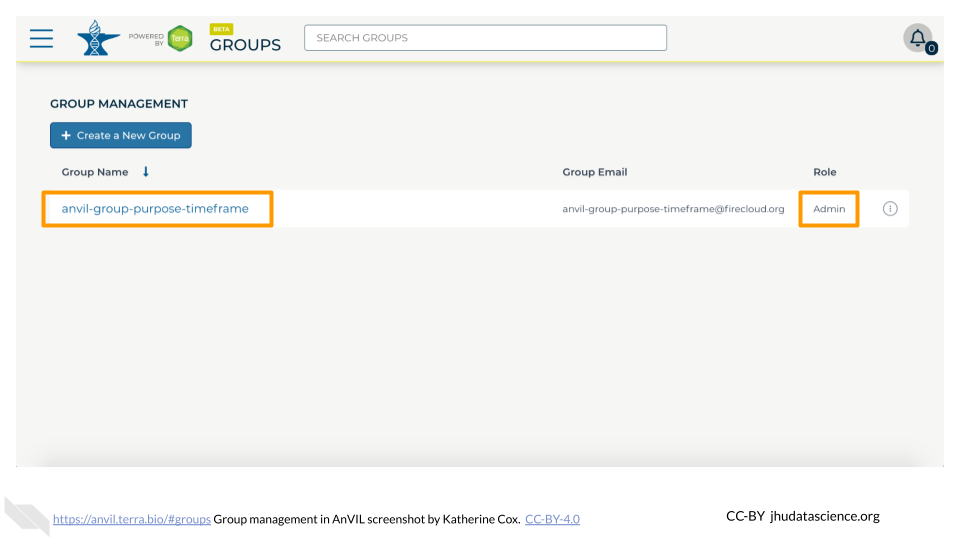
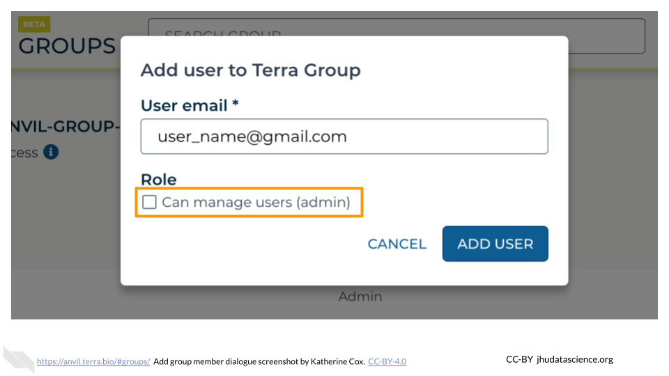
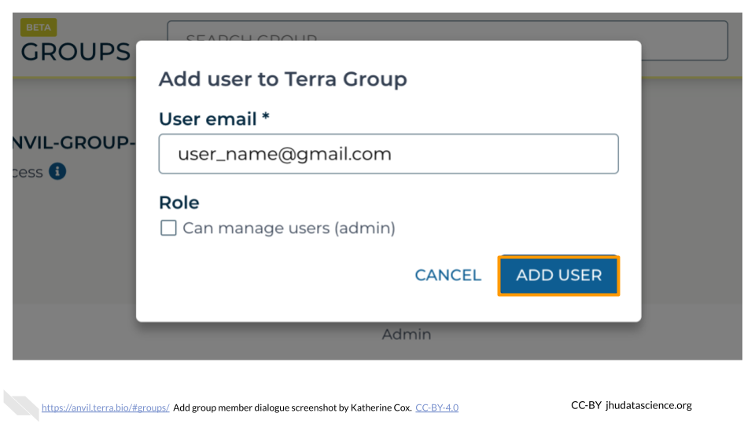
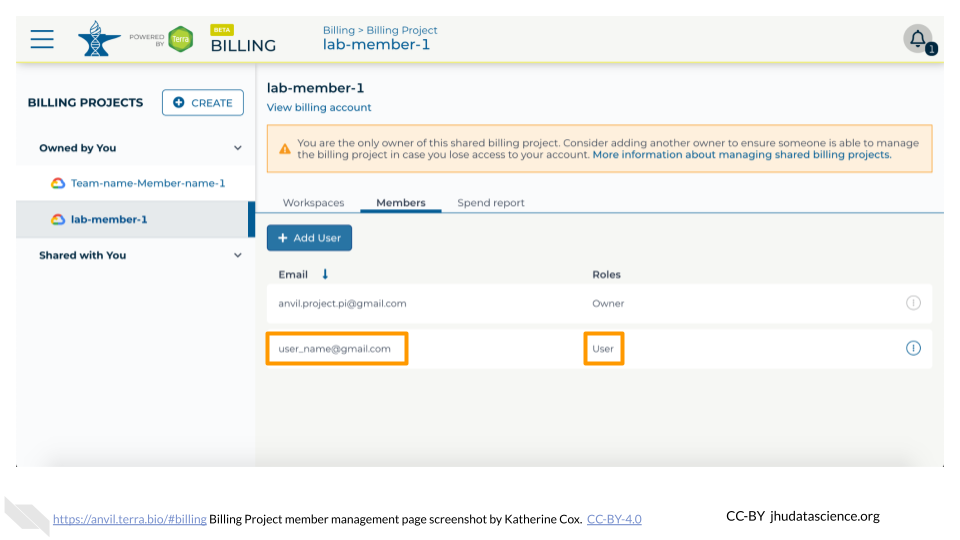

# (PART\*) Running The Class {-}

# Overview {#run-class}

This section describes how to get your students set up to access AnVIL.  These steps will need to be *repeated for each new offering of the course*.

 

::: {.warning}

If you are new to AnVIL, **we strongly recommend seeking funding through NHGRI / STRIDES for teaching your course**.  In order to prevent abuse, Google sets certain limits on cloud resources available to new users that can complicate teaching (e.g. [project quotas](https://support.terra.bio/hc/en-us/articles/6101030164507-When-workspace-creation-fails-Google-project-quotas)).  As you or your institution builds a payment history with Google, the limits on your accounts will be relaxed.  In the meantime, STRIDES funding can help ensure your initial classes run smoothly.

**What is STRIDES?**  NHGRI's [strategic vision](https://pubmed.ncbi.nlm.nih.gov/33116284/) highlights the importance of training the next generation of genomic scientists.  In collaboration with the NIH Office of Data Science Strategy, NHGRI makes funding available to AnVIL users through the [STRIDES](https://datascience.nih.gov/strides) program, which aims to promote biological research in cloud environments. 

**To inquire about funding your class on AnVIL, please contact help@lists.anvilproject.org.**
:::

::: {.notice}
**Notify Terra**

In addition to setting up your class, you may want to contact Terra to [submit a request](https://support.terra.bio/hc/en-us/requests/new) for a hold on scheduled maintenance and downtime.  Contacting Terra ahead of your class time helps the Terra team avoid any major disruptions to your class.  It’s also a good idea to ask about major changes planned for the time prior to your class.
:::

## Checklist and Timeline

Here is a [checklist](https://docs.google.com/document/d/1-HqQqH_qlkHwRua8-b92MyKQcEmcl0Nk37rSYqP49aw/edit) to help you keep track of the steps for setting up and teaching on AnVIL. Details about each of these steps can be found in the [AnVIL Instructor Guide](https://jhudatascience.org/AnVIL_Book_Instructor_Guide).  *Note that this checklist is written for workshop instructors as well as classroom instructors, so some of the "Event Setup" steps may not be applicable to you, depending on your teaching context.*

Here is a suggested timeframe for working through the checklist:

**1+ month before:**

- Figure out how you will fund the class/workshop.
- Start working through INSTRUCTOR SETUP.
    - It's a good idea to get billing figured out with plenty of time to spare.
    - Take some time to familiarize yourself with the content and make any desired updates or customizations.
- Do any necessary EVENT SETUP steps.

**~1 week before:**

- Start working through RUNNING THE CLASS.
- If possible, have students log in to AnVIL and send you their usernames, so you can add them to the Student Group ahead of time.  This saves time on the day of the class.
- **Do not add students to your Billing Project** ahead of time.  This prevents them from accruing costs.

**Day of (or shortly before):** 

- Add students to Billing Project.
- Have students clone the Workspace (They cannot do this until you have added them to the Billing Project.  As soon as they do this, they can start computing.).

**After:**

- Collect feedback, if you didn't do it during the class/workshop.
- Work though EVENT WRAP-UP - **until you shut things down, you will continue to accrue costs**.

# Set Up Funding

Depending on how you are being funded, this may be taken care of for you. If your funding is being managed by a third party (e.g. through a funding mechanism such as [STRIDES](https://datascience.nih.gov/strides), or through your institution), contact them to determine whether you should create a Terra Billing Project for your students.

:::{.warning}
Regardless of who is managing funding, it is essential to make sure that you have permission to create enough Workspaces for all of your students!

To prevent abuse, new users are only permitted to create a few Workspaces.  See [Request Quota Increase](#quota-increase) for more information about how to make sure your students will be able to create Workspaces.
:::

## Create Student Billing Project

As a reminder, Terra Billing Projects are how you grant people, including your students, permission to compute on AnVIL.  By adding someone to your Billing Project, you enable them to use your funding to carry out activities on AnVIL.

You *can* just add students to the same Billing Project that you are using yourself, but we generally recommend creating a separate Billing Project to fund student activity.  This makes it easy to deactivate when the course is over, without freezing your own projects.

**Note:** Terra Billing Projects need unique names.  One option is to use a combination of institution-class-role-term (e.g. `jhu-bio101-students-2023FA`).

To create a Terra Billing Project:

:::: {.borrowed_chunk}

1. [Launch Terra](https://anvil.terra.bio/#workspaces) and sign in with your Google account.  If this is your first time logging in to Terra, you will need to accept the Terms of Service.

1. In the drop-down menu on the left, navigate to "Billing". Click the triple bar in the top left corner to access the menu. Click the arrow next to your name to expand the menu, then click "Billing".  You can also navigate there directly with this link: https://anvil.terra.bio/#billing

    

1. On the Billing page, click the "+ CREATE" button to create a new Billing Project. If prompted, select the Google account to use.  If prompted, give Terra permission to manage Google Cloud Platform billing accounts.

    

1. Enter a **unique** name for your Terra Billing Project and select the appropriate Google Billing Account. The name of the Terra Billing Project must:
    + Only contain lowercase letters, numbers and hyphens
    + Start with a lowercase letter
    + Not end with a hyphen
    + Be between 6 and 30 characters

    
    
1. Select the Google Billing Account to use.  All activities conducted under your new Terra Billing Project will charge to this Google Billing Account.  If prompted, give Terra permission to manage Google Cloud Platform billing accounts.

    

1. Click "CREATE BILLING PROJECT".

    

1. Your new Billing Project should now show up in the list of Billing Projects Owned by You.  You can add additional members or can modify or deactivate the Billing Project at any time by clicking on its name in this list.

    

The page doesn't always update as soon as the Billing Project is created.  If it's been a couple of minutes and you don't see a change, try refreshing the page.
::::

::: {.notice}
**Reminder**: It's often a good idea to add at least one other Owner of a Billing Project in order to avoid getting locked out, in case the original owner loses access to their account.  See the section on [adding instructors to a billing project](#add-instructors-billing-project) if you need a reminder on how to do this.
:::

## Request Project Quota Increase {#quota-increase}

To prevent abuse, new users are only permitted to create a few Workspaces.  If each of your students needs their own Workspace (e.g. they each clone their own copy of a Workspace), you will quickly run into this limit and students will not be able to clone or create new Workspaces.

This limit is imposed by Google, rather than Terra (Google only permits you to create a few Google Cloud "Projects", and each Terra Workspace is a Google Cloud Project), so you will need to contact Google directly to request a "billing quota increase", using [this form](https://support.google.com/code/contact/billing_quota_increase).  This should be done by the owner of the Google Billing Account.  If you set up billing yourself, this is you; otherwise talk to your funding provider and make sure that you have enough Google Cloud Projects available for all your students (typically one per student, unless students need multiple Workspaces).

At the time of writing (Feb 2023) Terra is working to expedite this process for Terra users; we recommend checking the [relevant Terra documentation](https://support.terra.bio/hc/en-us/articles/6101030164507-When-workspace-creation-fails-Google-project-quotas) for the latest information as well as recommendations about how to fill out the form.

In our experience, the process has been reasonably straightforward and quick (approved in a couple of days).

# Set Up Student Accounts

In order for your students to compute on AnVIL, they will need to set up an account and provide you with their username so that you can grant them access to resources (Billing Projects and Workspaces).

If possible, it can be helpful to do this ahead of time, so that you do not need to dedicate class time for it.

 

::: {.warning}
Make sure you understand when and where your students can spend money!

The following actions will give your students the ability to spend money on AnVIL:

- Adding them to a **Billing Project** - this will let them create their own Workspaces
- Adding them as **Writers or Owners to a Workspace** - this will let them compute in the Workspace
:::

Our recommendation is to **do most set up ahead of time**:

- Create Student Group (and add Instructors)
- Have students create accounts (and collect usernames)
- Add students to the Student Group
- Give the Student Group access to any Workspaces **as Readers**.  This will let them view the contents but not spend money.

**Wait until shortly before the students need to compute** to add the Student Group to the Billing Project. This prevents them from accruing costs on your Billing Project without your guidance.

This chapter walks through all of the student setup steps that can safely be done ahead of time.  The final step for activating student billing is covered in the next chapter.

## Create Student Group {#student-group}

Creating a Group for your students will let you easily manage the class as a whole by granting the Group access to Billing Projects and Workspaces.

You will need a unique name for your Group. We suggest a combination of institution-class-role-term (e.g., `jhu-bio101-students-2023FA`). Only letters, numbers, underscores, and dashes are allowed in Group names.

To create a Group:

::::{.borrowed_chunk}

1. [Launch Terra](https://anvil.terra.bio/#workspaces) and sign in with your Google account.

1. In the drop-down menu on the left, navigate to "Groups". Click the triple bar in the top left corner to access the menu. Click the arrow next to your name to expand the menu, then click "Groups".  You can also navigate there directly with this link: https://anvil.terra.bio/#groups

    

1. Click "+ Create a New Group"

    

1. Enter a name for your group.  Names must be unique, so it’s often helpful to include your team’s name, the purpose of the group, and optionally the timeframe, if you will have similar groups in the future.

    

1. Click "CREATE GROUP"

    

1. Your new Group should now show up on the Group Management screen.  Take note of the email address associated with your group.  You will use this email to grant the group access to Billing Projects and Workspaces.

    
::::

You now have a unique **Student Group**.

### Add Instructors to Group

Now that your student Group has been created, you should add any additional instructors / course coordinators as **Admins**.  This will give them permission to add and remove students, in case you are unavailable.

::: {.notice}
If you created an instructor Group, you can instead add the *Instructor Group* as an Admin of the *Student Group*.  This will enable everyone in the Instructor Group to act as an Admin for the Student Group.  To do this, you will need the email address associated with the Instructor Group, which can be found on the Group management page: https://anvil.terra.bio/#groups.
:::

The following instructions explain how to add someone to a Terra Group.  You will want to add instructors to the Student Group as **Admins**.

:::: {.borrowed_chunk}

1. [Launch Terra](https://anvil.terra.bio/#workspaces) and sign in with your Google account.

1. In the drop-down menu on the left, navigate to "Groups". Click the triple bar in the top left corner to access the menu. Click the arrow next to your name to expand the menu, then click "Groups".  You can also navigate there directly with this link: https://anvil.terra.bio/#groups

    

1. Find the name of the Group you want to add someone to, and confirm that you have Admin privileges for the Group (you can only add and remove members to a Group if you are an Admin).  Click on the name of the Group to view and manage members.

    

1. Click on "+ Add User". You will be prompted to enter the user’s AnVIL ID.

    

1. Type in the user’s email address.  Make sure this is the account that they will be using to access AnVIL.

    

1. If this member will need to add and remove other members of the Group, check the box for "Can manage members (admin)".  This will add them as an "Admin" for the Group.  Otherwise leave it unchecked, and they will be added as a "Member".
     - Admins and Members have equal access to any resources shared with the Group.
     - Admins can manage Group membership - they can add, remove, or change the role of other Group members.

    

1. Click ADD USER. This will take you back to the Group administration page.

    
    
1. The new Group member will now be shown in the list of group members, along with their role.  They should now have access to anything that the Group has been given access to.

    

If you need to remove members or modify their roles, you can do so at any time by clicking the teardrop button next to their name.

::::

## Have Students Create Accounts

Each of your students will need to:

1. Create a Google account, if they do not already have one
2. Sign in to Terra
3. Provide you with their username, so that you can add them to your Student Group

Student-facing instructions for account creation (and several other activities) are provided in the [**Student Instructions**](#student-instructions) section.

## Add Students to Group

Once your students have accounts, you will need to add them to your Student Group as **Members**.

::: {.notice}
In order to add students to your Group, you will need the usernames for the Google accounts your students are using to access AnVIL.
:::

Unfortunately there is currently no way to add members to a Group in bulk, so you will need to add students to the Group one-by-one.

The following instructions explain how to add someone to a Terra Group.  You will want to add students to the Group as **Members**.

:::: {.borrowed_chunk}

1. [Launch Terra](https://anvil.terra.bio/#workspaces) and sign in with your Google account.

1. In the drop-down menu on the left, navigate to "Groups". Click the triple bar in the top left corner to access the menu. Click the arrow next to your name to expand the menu, then click "Groups".  You can also navigate there directly with this link: https://anvil.terra.bio/#groups

    

1. Find the name of the Group you want to add someone to, and confirm that you have Admin privileges for the Group (you can only add and remove members to a Group if you are an Admin).  Click on the name of the Group to view and manage members.

    

1. Click on "+ Add User". You will be prompted to enter the user’s AnVIL ID.

    

1. Type in the user’s email address.  Make sure this is the account that they will be using to access AnVIL.

    

1. If this member will need to add and remove other members of the Group, check the box for "Can manage members (admin)".  This will add them as an "Admin" for the Group.  Otherwise leave it unchecked, and they will be added as a "Member".
     - Admins and Members have equal access to any resources shared with the Group.
     - Admins can manage Group membership - they can add, remove, or change the role of other Group members.

    

1. Click ADD USER. This will take you back to the Group administration page.

    
    
1. The new Group member will now be shown in the list of group members, along with their role.  They should now have access to anything that the Group has been given access to.

    

If you need to remove members or modify their roles, you can do so at any time by clicking the teardrop button next to their name.

::::

## Add Student Group to Workspace

Now that you have added students to the Group, you can easily share Terra resources with the entire Group.

First, you will need to give your Student Group access to any Workspaces that they will need.

If you are **using a Public Workspace** (most pre-made content uses Public Workspaces), **you can skip this step** - Public Workspaces are automatically available to everyone on AnVIL.  

If you have **Workspaces of your own** that your students will need to access, you should **add the Student Group to your Workspace(s) as a *Reader***.

- Adding students as a Reader gives them permission to view the Workspace, and (once they have funding) to **clone their own copy**.  This will enable them to work safely in their own space without interfering with each other or overwriting anything in the original Workspace.
- Adding students to your Workspace(s) can safely be done ahead of time; as Readers they can't run computations and run up a bill.

Adding the Student Group to a Workspace will give all members of the Group access to the Workspace in one easy step. To add the Student Group to a Workspace, you will need the Group email address, which can be found on the Group management page: https://anvil.terra.bio/#groups

The following instructions explain how to add users to a Terra Workspace.  You will want to add the Student Group to the Workspace as **Reader**.

:::: {.borrowed_chunk}

1. [Launch Terra](https://anvil.terra.bio/#workspaces)

1. In the drop-down menu on the left, navigate to "Workspaces". Click the triple bar in the top left corner to access the menu. Click "Workspaces".

    

1. Click on the name of the Workspace to open the Workspace. Opening a Workspace does not cost anything.  Certain activities in the Workspace (such as running an analysis) will charge to the Workspace’s Billing Project.  Workspace management (e.g. adding and removing members, editing the description) does not cost money.

    

1. Click the teardrop button ({width=25px}) on the right hand side to open the Workspace management menu.  Click "Share"

    

1. Enter the email address of the user or Group you’d like to share the Workspace with.
    - If adding an individual, make sure to enter the account that they use to access AnVIL.
    - If adding a Terra Group, use the Group email address, which can be found on the Terra Group management page.

    

1. Choose their permission level.

    - Remember that all activity in the Workspace will be charged to the Workspace's Billing Project, regardless of who conducts it, so only add members as "Writers" or "Owners" if they should be charging to the Workspace's Billing Project.
    - "Readers" can view all parts of the Workspace but cannot make edits or run analyses (i.e. they cannot spend money).  They can also clone their own copy of the Workspace where they can conduct activity on their own Billing Project.

    

1. Click "Save".  The user should now be able to see the Workspace when logged in to Terra.

    
::::

Make sure the newly added Student Group displays "Reader" under "Roles".

# Teach the Class

This chapter covers things that you will generally do on the day of the class:

 
 

**Before class**

- Add students to Billing Project
- Direct students to clone the Workspace (this can be done in the first few minutes of class)

**After class**

- Give students any necessary instructions on how to save and export any important files, and how to pause or delete their cloud environments
- Collect feedback

## Before: Add Student Group to Billing Project

When you are ready for your students to start computing, you should add the Student Group to your Billing Project.  This will enable everyone in the Group to clone or create Workspaces funded by the Billing Project.  Everything they do in those Workspaces will be charged to your Billing Project.

We generally recommend waiting until shortly before the class to add students to the Billing Project, to prevent them from starting something up early and accruing costs.  *However, if you did not create the Terra Billing Project for your class, you should make sure that either you have been given "Owner" permission for the class Billing Project (so you can add students yourself), or that someone who does is prepared to add students in time for your class to start.*

::: {.warning}
To add members to a Billing Project, you must be an "Owner" of the Billing Project.

- If you created the Billing Project yourself, you're good to go!
- If a third party created the Billing Project, check to see whether you are an Owner or a User.  If you are not an Owner, you will need to contact your funding manager.  They can either make you an Owner, or can add the Student Group to the Billing Project themselves.
:::

To add the Student Group to the Workspace, you will need the Group email address, which can be found on the Group management page: https://anvil.terra.bio/#groups

The following instructions explain how to add someone to a Terra Billing Project.  You will want to add the Student Group to the Billing Project as a **User**.

:::: {.borrowed_chunk}

1. [Launch Terra](https://anvil.terra.bio/#workspaces) and sign in with your Google account.

1. In the drop-down menu on the left, navigate to "Billing". Click the triple bar in the top left corner to access the menu. Click the arrow next to your name to expand the menu, then click "Billing".  You can also navigate there directly with this link: https://anvil.terra.bio/#billing

    

1. Click “Owned by You” and find the Billing Project.  If you do not see the Billing Project in this list, then you are not an Owner and do not have permission to add members.

    

1. Click on the name of the Billing Project.

    

1. Click on the “Members” tab to view and manage members.  Then click the “Add User” button.

    
    
1. Enter the email address of the user or group you’d like to add the the Billing Project.
    - If adding an individual, make sure to enter the account that they use to access AnVIL.
    - If adding a Terra Group, use the Group email address, which can be found on the Terra Group management page.

    

1. If this user or group will need to add and remove other users of the Billing Project, check the Owner box.  Otherwise leave it unchecked.
    - It’s often a good idea to have at least one other Owner of a Billing Project in order to avoid getting locked out, in case the original owner leaves or loses access to their account.

    

1. Click “ADD USER”.

    

1.  You should now see the user or group listed in the Billing Project members, along with the appropriate role.  They should now be able to use the Billing Project to fund work on AnVIL.

    
    
If you need to remove members or modify their roles, you can do so at any time by clicking the teardrop button next to their name.

::::

Make sure the newly added Student Group displays "User" under "Roles".

## Before: Direct Students to Clone Workspace

Your students will each need to clone their own copy of the class Workspace.

We typically have students clone the Workspace in the first few minutes of class.  This both helps ensure they won't start up their cloud environments early, and ensures they get the most up-to-date version of the Workspace.

Student-facing instructions for [how to clone a Workspace](#student-clone-workspace) are provided in the **Student Instructions** section.

You will need to provide your students with a link to the Workspace they will be cloning, and the name of the Billing Project they should use.

## After: Instruct Students on Shutdown

If your students will not be doing any more work in this Workspace, have students export any files they wish to keep.  Once you disable Billing, they (and you) will lose access to files in the Workspace.

If your students will continue using the Workspace in a subsequent class or for homework, have them pause or delete the cloud environment to minimize charges accrued while they are not working.

## After: Collect Feedback

If you are using one of the premade courses, we would appreciate feedback!  If you are willing to ask your students to provide feedback, please direct them to this form:

https://forms.gle/AK12iVXTjsB7yCUUA

Responses are anonymous, unless the responder chooses to provide contact information for follow up.

We would also greatly appreciate feedback from you as the instructor!  Comments can be submitted through the same form, or if you are comfortable on GitHub you can open an issue in the corresponding repository.

# Shutting Down

Once your students are done working, you will want to deactivate the Billing Project.

 

:::{.warning}
**It is essential to disable the Billing Project, not just remove students from it!**

Removing students from the Billing Project will prevent them from making new Workspaces, but will not stop them from computing in Workspaces that already exist.  You will continue to accrue costs for any storage and cloud environments until you disable the Billing Project.
:::

:::{.warning}
**Disabling the Billing Project makes the Workspace contents inaccessible!**

You will be unable to access any data stored in the Workspace or cloud environment.  It is sometimes possible to restore access by reactivating billing, but Google makes no promises about whether the data will be recoverable.

**Make sure you and your students have saved anything you want to keep in another location** before disabling billing for your class.
:::

:::: {.borrowed_chunk}

1. [Launch Terra](https://anvil.terra.bio/#workspaces) and sign in with your Google account.

1. In the drop-down menu on the left, navigate to "Billing". Click the triple bar in the top left corner to access the menu. Click the arrow next to your name to expand the menu, then click "Billing".  You can also navigate there directly with this link: https://anvil.terra.bio/#billing

    

1. Click "Owned by You" and find the Billing Project.  If you do not see the Billing Project in this list, then you are not an Owner and do not have permission to add members.

    

1. Click on the name of the Billing Project.

    
    
1. If you don't see information about the Billing Account, click on “View billing account” to expand the Billing Account information.  You may be prompted to enter your login information again.

    

1. You should see the name of the Google Billing Account that is funding this Terra Billing Project.  Click on the teardrop icon next to the name of the Billing Account.

    

1. Click "Remove Billing Account".

    

1. Click OK to confirm that you want to disable funding for this Billing Project.

    

1. The page should now indicate that there is no linked billing account.

    

If necessary, you can restore funding to the Billing Project and associated Workspaces by clicking the teardrop icon and selecting "Change Billing Account".  However, Google makes no promises about how long the Workspace contents will remain available after you disable funding, so it is best not to rely on them.

::::
