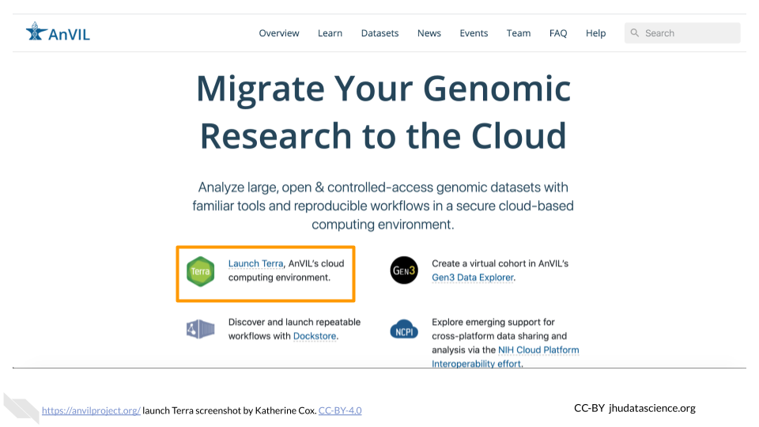

# (PART\*) Instructor Setup {-}

# Account Setup

## Overview of Account Setup

AnVIL uses [Terra](https://anvil.terra.bio/) to run analyses. Terra operates on Google Cloud Platform, so you’ll pay for all storage and analysis costs through a Google account linked to Terra. The costs are the standard Google Cloud Platform fees for storing and moving data as well as executing an analysis. These costs are passed along through Terra without any markup.

## Step 1: Create a Google Account {#google-account}

Terra operates on Google Cloud Platform, so you will need a (free) Google account which will allow you to access the Terra platform to manage students and in-class analyses.

Your Google account will also (1) allow you to manage billing yourself or (2) allow a Program Manager to do so on your behalf.

If you do not already have a Google account that you would like to use for accessing Terra, [create one now](https://accounts.google.com/SignUp).

If you would like to create a Google account that is associated with your non-Gmail, institutional email address, follow [these instructions](https://support.terra.bio/hc/en-us/articles/360029186611).

## Step 2: Sign in to Terra

You need to sign into Terra to allow Billing Project managers to add you to projects and/or Workspaces. [Launch Terra](https://anvil.terra.bio/#workspaces), and you should be prompted to sign in with your Google account.

You can always access Terra by going to [`anvil.terra.bio`](https://anvil.terra.bio/), or by clicking the link on the AnVIL home page.

