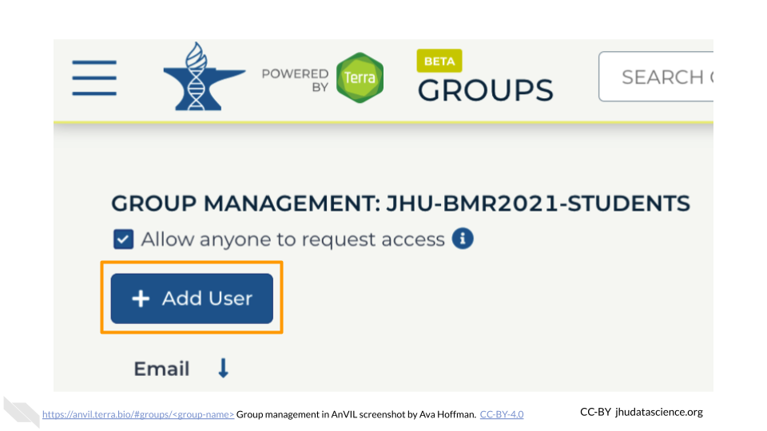
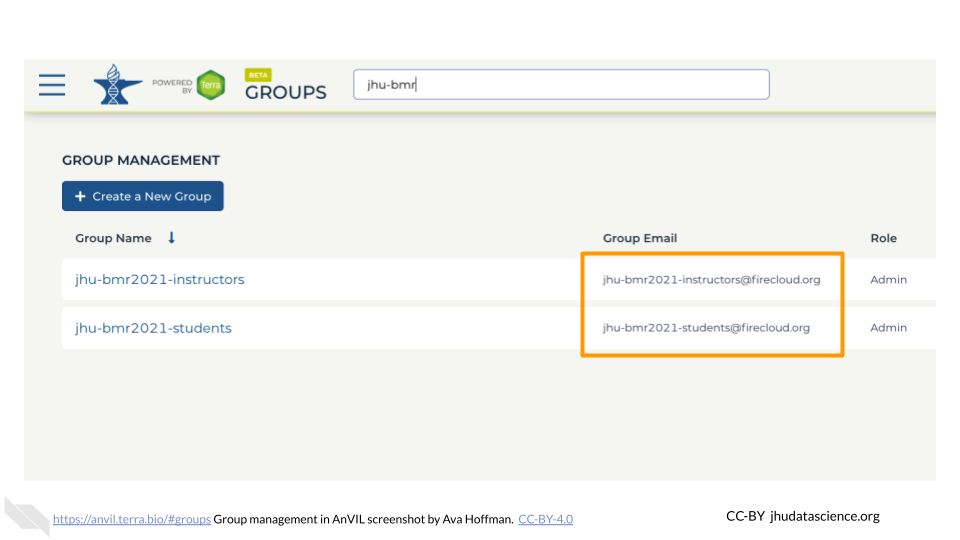
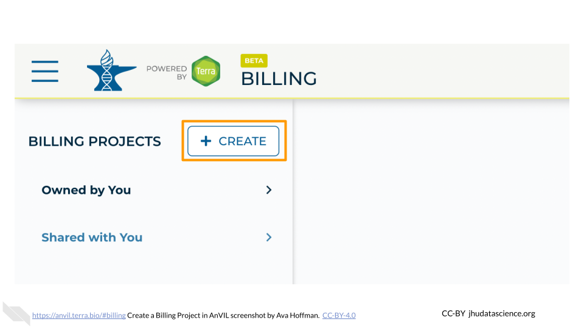
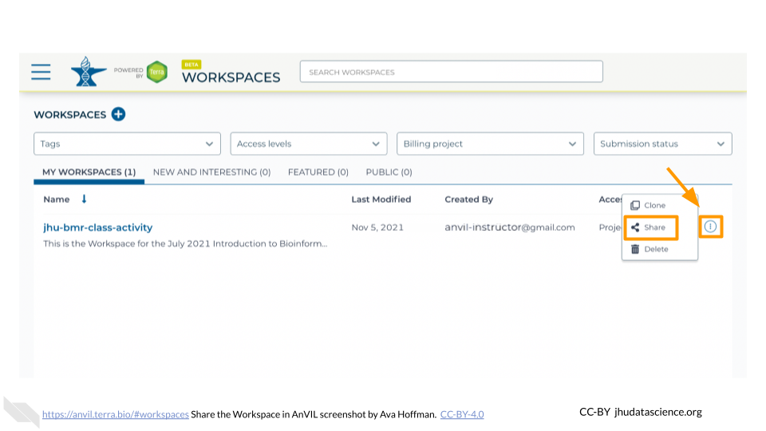

# (PART\*) For Each Class {-}

# Class Setup

## Overview of Class Setup

This section will show you how to organize your class to make it easier to administer access to your content. You will need to have a list of who will be taking your class, such as a course roster or sign-up list, as well as a list of additional instructors or teaching assistants. You can make changes later, so the list of students need not be final.

## Identify Funding

### NHGRI STRIDES {#strides-funding}

Through the [STRIDES](https://datascience.nih.gov/strides) program, NHGRI makes funding available to new users of the AnVIL, in collaboration with the [NIH Office of Data Science Strategy](https://datascience.nih.gov/about/odss). NHGRI currently supports the [AnVIL Cloud Credits Program (AC2)](https://anvilproject.org/news/2021/04/12/announcing-anvil-cloud-cost-credits-program) and will have a second round of funding available in fall of 2021.

## Collect Google IDs

AnVIL IDs are based on [Google accounts](account-setup.html#google-account).

Students -- Contact students/participants to get their AnVIL IDs. These should be Gmail addresses or emails with GSuite capabilities. You can link students to [Student Account Setup](student-account-setup.html) for instructions on what they should do.

Co-instructors -- If you will be working with other instructors, such as co-instructors or teaching assistants, you will need to collect their IDs as well.

## Set Up Groups
Reminder:

- Google **Billing Accounts** are managed on Google Cloud Platform and are used for organizing *funding sources* (e.g. credit cards, cloud credits).
- Terra **Billing Projects** are managed through Terra, and allow you to associate your Terra activity with the correct Google Billing Account.

For a more detailed explanation, please see the chapter on Account Setup.

We suggest creating two different Terra Billing Projects under the appropriate Billing Account that you created on `cloud.google.com`: one for students and one for co-instructors. The instructions below will walk you through how to set this up.

Groups enable you to share your class Workspace and manage permissions for many people at once. We recommend starting with one Group for instructors and one Group for students.

### Instructor Group {#instructor-group}

Create an informative, unique Group name for any co-instructors and teaching assistants. We suggest a combination of institution-class-role (e.g., “jhu-bmr2021-instructors”). Only letters, numbers, underscores, and dashes are allowed in Group names. To create a Group for instructors:

1. Go to https://anvil.terra.bio/#groups

1. Click “+ Create a New Group”

    

1. Type in your instructor Group name

1. Click “CREATE GROUP”

    

You now have a unique **instructor Group**.

### Add Instructors as "Admin" (Instructor Group)

Now that your instructor Group has been created, you should add any additional instructors. You should also ensure that they have the correct permissions. 

1. Go to https://anvil.terra.bio/#groups/ and click on the instructor Group name. This page should also be visible at `https://anvil.terra.bio/#groups/<group-name>`.

    

1. Click on “+Add User”. You will be prompted to add the instructor’s AnVIL ID. 

    

1. Type in the instructor’s AnVIL ID

    

1. Make sure “Can manage users (admin)” is **selected**

    

1. Click ADD USER. This will take you back to the Group administration page.

    

Make sure the newly added instructor displays “Admin” under “Roles” beside their AnVIL ID. Repeat this process for any additional co-instructors and teaching assistants.

### Student Group {#student-group}

Next, you will create a Group for your students. Create an informative, unique Group name. We suggest a combination of institution-class-role (e.g., “jhu-bmr2021-students”). Only letters, numbers, underscores, and dashes are allowed in Group names. To create a Group for students:

1. Go to https://anvil.terra.bio/#groups

1. Click “+ Create a New Group”

    

1. Type in your student Group name

1. Click “CREATE GROUP”

    

You now have a unique **student Group**.

### Add Instructors as "Admin" (Student Group)

The next steps ensure any additional co-instructors and teaching assistants are able to administer the student Group in case you are unavailable. Follow the steps below to add each co-instructor in the student Group:

1. Go to https://anvil.terra.bio/#groups/ and click on the student Group name. This page should be visible at `https://anvil.terra.bio/#groups/<group-name>`.

    

1. Click on “+Add User”. You will be prompted to add the instructor’s AnVIL ID. 

    

1. Type in the instructor’s AnVIL ID

    

1. Make sure “Can manage users (admin)” is **selected**

    

1. Click ADD USER. This will take you back to the Group administration page.

    

Make sure the newly added instructor displays “Admin” under “Roles” beside their AnVIL ID. Repeat this process for any additional co-instructors and teaching assistants.

### Add Students as "Member"

Follow the steps below to add individual students to the student Group:

1. Go to https://anvil.terra.bio/#groups/ and click on the student Group name. This page should be visible at `https://anvil.terra.bio/#groups/<group-name>`.

    

1. Click on “+Add User”. You will be prompted to add an AnVIL ID. 

    

1. Type in the student’s AnVIL ID

    

1. Click ADD USER

    

Make sure the newly added student displays “Member” under “Roles” beside their AnVIL ID. At present, each student’s AnVIL ID must be added separately.

Your instructor and student Groups are now set up.

### Group Email Lists

Note that your newly created Groups have Group emails associated with them. Take note of these Group emails. You will use them for granting access to your class Billing Projects and Workspaces in the next steps.

## Set Up Billing Projects

Billing Projects in Terra help organize your compute costs. Like Groups, we suggest creating two different billing projects under the appropriate Billing Account that you created on `cloud.google.com`: one for students and one for co-instructors.

Billing Project names must be globally unique and cannot exceed 30 characters.

### Instructor Billing Project {#instructor-billing-project}

First, create the Billing Project for instructors. We suggest the name of the Billing Project should be a combination of institution-class-role (e.g., "jhu-bmr2021-instructors-bill-1"). To create a Billing Project for instructors:

1. Go to https://anvil.terra.bio/#billing

1. Click “+CREATE”

    

1. Type in your instructor Billing Project name

    
    
1. Select the appropriate Billing Account

    
    
1. Click “CREATE BILLING PROJECT”

    
    
You now have a unique **instructor Billing Project**.

### Add Instructors as “Owner” (Instructor Project)

Next, you want to give instructors permission to use the Billing Project to compute. To set instructor permissions:

1. Go to https://anvil.terra.bio/#billing

1. Select the “Owned by You” Billing Project sub-list

    

1. Select the Billing Project you made for instructors in [Instructor Billing Project](#instructor-billing-project)

    

1. Select the “Users” tab

    

1. Click “+ Add User”. You will be prompted to add a “User email *”.

    

1. Begin typing the instructor Group name set up in [Instructor Group](#instructor-group). You should see an email in the form <group-name>@firecloud.org (e.g., jhu-bmr2021-instructors@firecloud.org).

1. Ensure “Can manage users (Owner)” is **selected**

    

1. Click “ADD USER”

    

Your **instructor Billing Project** is now set up.

### Student Billing Project {#student-billing-project}

Next, create a student Billing Project. Again, we suggest a combination of institution-class-role (e.g., “jhu-bmr2021-students-bill-1”). To create a Billing Project for students:

1. Go to https://anvil.terra.bio/#billing 

1. Click “+CREATE”

    
    
1. Type in your student Billing Project name

    
    
1. Select the appropriate Billing Account (same as above)

    

1. Click “CREATE BILLING PROJECT”

    

You now have a unique **student Billing Project**.
   
### Add Instructors as “Owner” (Student Project)

You want to ensure any additional co-instructors and teaching assistants are able to administer the student Billing Project in case you are unavailable. To set instructor permissions:

1. Go to https://anvil.terra.bio/#billing

1. Select the “Owned by You” Billing Project sub-list

    

1. Select the Billing Project you made for students in [Student Billing Project](#student-billing-project)

    

1. Select the “Users” tab

    

1. Click “+ Add User”. You will be prompted to add a “User email *”.

    

1. Begin typing the instructor Group name set up in [### Set Up Groups]. You should see an email in the form <group-name>@firecloud.org (e.g., jhu-bmr2021-instructors@firecloud.org).

1. Ensure “Can manage users (Owner)” is **selected**

    

1. Click “ADD USER”

    
    
::: {.fyi}
This step makes it so that co-instructors can edit permissions and administer the student Billing Project as needed. While this means you and co-instructors can compute using the student Billing Project, this makes spending difficult to track. Instructors should always use the **instructor Billing Project** to compute. This makes it much easier to track costs associated with instructors versus students.
:::

### Add Students as “User”

Next, you will add your student Group to the student Billing Project so that they can compute. To set student permissions:

1. Go to https://anvil.terra.bio/#billing

1. Select the “Owned by You” Billing Project sub-list

    

1. Select the Billing Project you made for students in [Student Billing Project](#student-billing-project)

    

1. Select the “Users” tab

    

1. Click “+ Add User”. You will be prompted to add a “User email *”.

    

1. Begin typing the student Group name set up in [Student Group](#student-group). You should see an email in the form <group-name>@firecloud.org (e.g., jhu-bmr2021-students@firecloud.org). 

1. Keep “Can manage users (Owner)” **deselected**.

    

1. Click “ADD USER”

    

Your **student Billing Project** is now set up.

## Set Permissions - Workspace

Finally, you will want to set up permissions for co-instructors and students to see the class Workspace you created with the development Billing Project in [Developing Content](developing-content.html). AnVIL users can take on the "Owner", "Writer", or "Reader" role for a Workspace.

### Add Instructors as “Owner”

You should add your co-instructors and teaching assistants as “Owners” to the class Workspace. This is useful if they need to edit the course content or share the space with students on your behalf. To share and change permissions:

1. Go to https://anvil.terra.bio/#workspaces and find your class Workspace you set up in [Developing Content](developing-content.html)

1. Click the teardrop button for your class Workspace

1. Click “Share”. This will open a dialog box.

    

1. Enter the name of the instructor Group (e.g., jhu-bmr2021-instructors). This will create a dropdown for the Group permissions in the box. Select this Group.

    

1. Change permissions to “Owner” using the dropdown menu under the instructor Group

    

1. Click “SAVE”

    

::: {.fyi}
This step makes it so that co-instructors can edit the original content of the Workspace as needed. While this means you and co-instructors can compute using the development Billing Project, this makes spending difficult to track. Instructors should instead clone the Workspace using the **instructor Billing Project**. This makes it much easier to track costs associated with this iteration of your class versus further iterations (e.g., the following semester or year).
:::

### Add Students as “Reader”

Next, add your students as “Readers” to the class Workspace. This means they will be able to view and clone the Workspace, but not make edits or perform computations. To share the Workspace:

1. Click the teardrop button for your class Workspace

1. Click “Share”. This will open a dialog box.

    

1. Enter the name of the student Group. This will create a dropdown for the Group permissions in the box. Select this Group.

    

1. Ensure permissions are set to “Reader” (default)

    

1. Click “SAVE”

    

You have now correctly set up your class permissions!

## Notify Terra

Contacting Terra ahead of your class time helps the Terra team avoid any major disruptions to your class. Contact Terra by [submitting a request](https://support.terra.bio/hc/en-us/requests/new) for a hold on scheduled maintenance and downtime. It’s also a good idea to ask about major changes planned for the time prior to your class.
